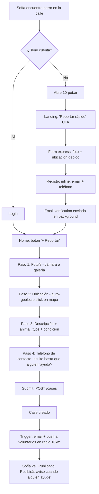
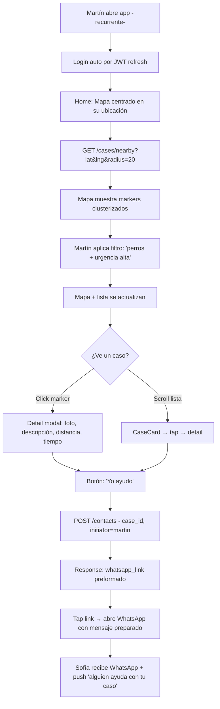
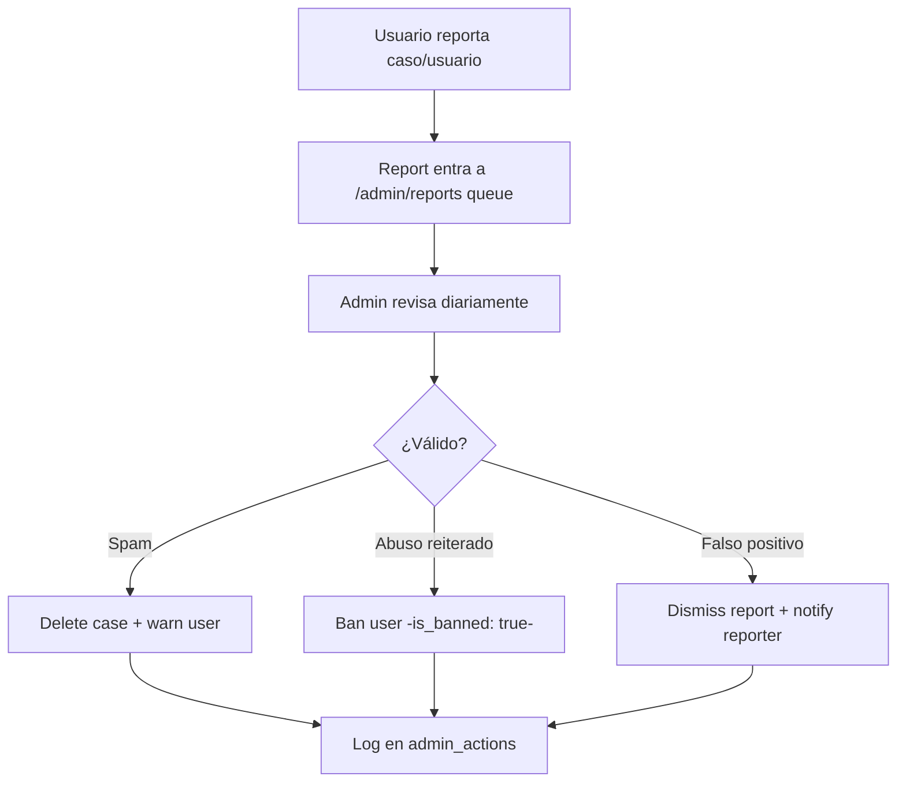
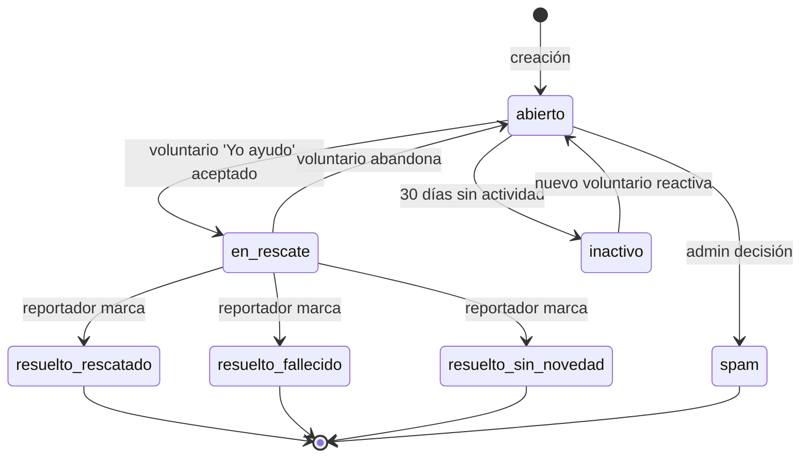
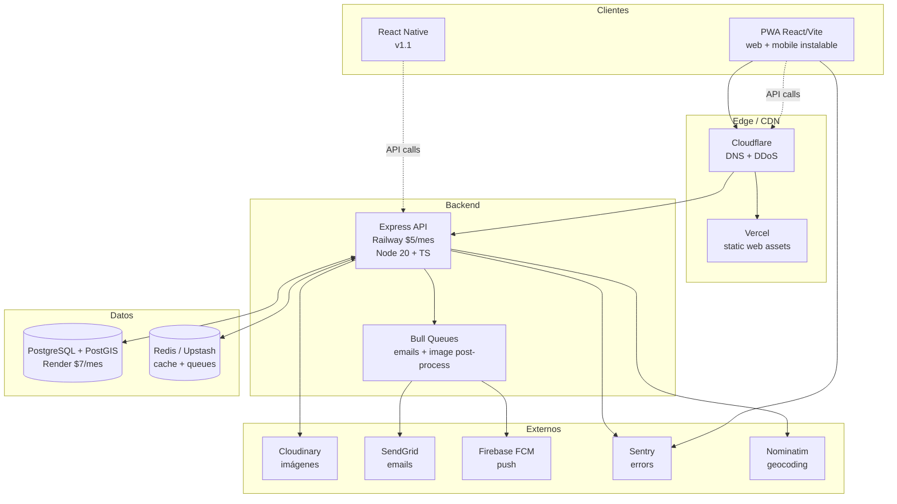
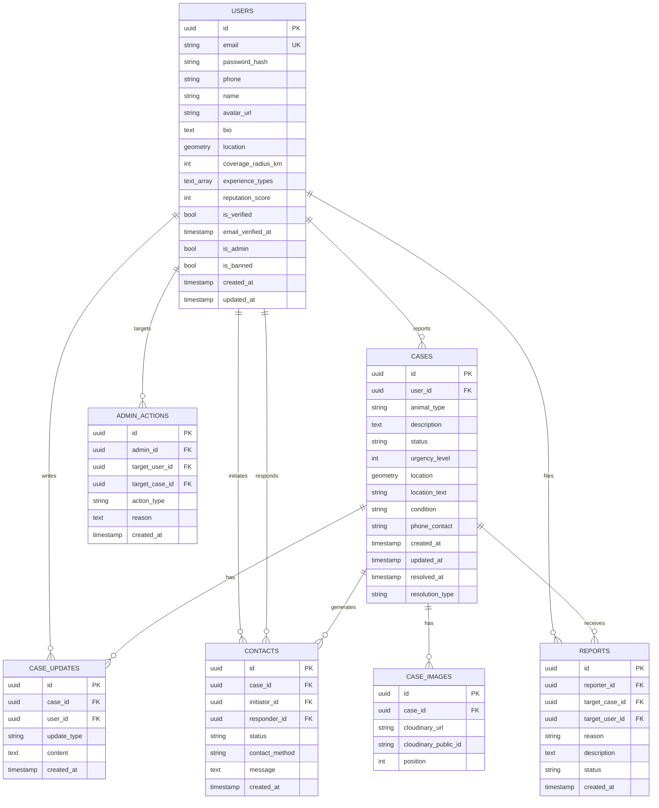

# PLAN_ULTRA — Rescate Animal Argentina + Comunidad de Mascotas

> Documento de planificación profesional completa
> Proyecto: **10_Pet**
> Fecha: 2026-04-12
> Versión: 1.0
> Estado: master plan — reemplaza los 4 docs anteriores (archivados en `/Home/legacy/`)

---

## Tabla de contenidos

**Parte 1 — Análisis estratégico**
1. [Análisis del problema y oportunidad](#1-análisis-del-problema-y-oportunidad)
2. [Qué se construye primero](#2-qué-se-construye-primero)
3. [Alcance geográfico inicial](#3-alcance-geográfico-inicial)
4. [Propuesta de valor diferenciadora](#4-propuesta-de-valor-diferenciadora)
5. [Análisis de competencia](#5-análisis-de-competencia)
6. [Definición de usuarios objetivo](#6-definición-de-usuarios-objetivo)

**Parte 2 — Producto (UX/UI + features)**

7. [Definición del MVP](#7-definición-del-mvp)
8. [Flujos de usuario principales](#8-flujos-de-usuario-principales)
9. [Pantallas principales (wireframes descriptivos)](#9-pantallas-principales)
10. [Sistema de estados y notificaciones](#10-sistema-de-estados-y-notificaciones)
11. [Sistema de contacto entre usuarios](#11-sistema-de-contacto-entre-usuarios)

**Parte 3 — Arquitectura técnica**

12. [Stack tecnológico completo](#12-stack-tecnológico-completo)
13. [Arquitectura del sistema](#13-arquitectura-del-sistema)
14. [Schema de base de datos](#14-schema-de-base-de-datos)
15. [Especificación de API](#15-especificación-de-api)
16. [Estructura de carpetas](#16-estructura-de-carpetas)
17. [Infraestructura y deployment](#17-infraestructura-y-deployment)
18. [Consideraciones técnicas especiales](#18-consideraciones-técnicas-especiales)

**Parte 4 — Ejecución**

19. [Roadmap semana a semana](#19-roadmap-semana-a-semana)
20. [Estrategia primeros 100 usuarios](#20-estrategia-primeros-100-usuarios)
21. [Plan de monetización](#21-plan-de-monetización)
22. [Análisis de riesgos](#22-análisis-de-riesgos)
23. [KPIs y métricas de éxito](#23-kpis-y-métricas-de-éxito)

**Anexos**

- [A. Glosario](#a-glosario)
- [B. Decisiones pendientes — validar con primeros 5 ONGs](#b-decisiones-pendientes)
- [C. Referencias externas](#c-referencias-externas)

---

## Lectura rápida — decisiones de alto nivel

| # | Decisión | Postura | Racional corto |
|---|----------|---------|----------------|
| 1 | Qué construir primero | **Solo Rescate (Concepto A)** en MVP. Comunidad B en v1.5 | Rescate genera tráfico y valida misión; Comunidad sin tráfico no funciona |
| 2 | Alcance geográfico | **Ciudad piloto (interior BsAs) → AMBA → Nacional** por fases | Validás con red personal + densidad garantizada en ciudad chica; expandís con prueba social real |
| 3 | Backend | Node.js + TypeScript + Express + PostgreSQL + PostGIS | Una lengua full-stack, ecosistema maduro, geo nativo |
| 4 | Frontend web | React + Vite + Tailwind + Leaflet/OSM | Gratis, rápido, productivo para 1 dev |
| 5 | Mobile | **PWA-first en MVP, React Native en v1.1** | Nativo suma 2-3 semanas y app stores. PWA cubre 90% caso |
| 6 | Contacto | **WhatsApp deep links** (MVP), chat in-app (v1.2) | Argentina vive en WhatsApp, cero infra |
| 7 | Auth | JWT + email verify + OAuth Google | Google reduce fricción para ONGs |
| 8 | Notificaciones | Email (SendGrid) + Push (FCM web + PWA) | FCM funciona en PWA instalada |
| 9 | Moderación | Reactiva (report + admin queue) MVP; ML en v1.1 | 1 dev no escala revisión proactiva |
| 10 | Monetización | Cero en MVP; donaciones + ONG Pro + brand sponsors post-launch | Misión social no se compromete |
| 11 | Timeline | **11 semanas realistas** con PWA | Plan previo con app nativa = muy ajustado |
| 12 | Equipo externo | Diseñador UI freelance 20-30h / $300-500 USD | UI genérica mata adopción; único gasto justificado |

---

# PARTE 1 — ANÁLISIS ESTRATÉGICO

## 1. Análisis del problema y oportunidad

### 1.1 Dimensión real del problema en Argentina

El abandono animal en Argentina es un problema **estructural, no anecdótico**. Números que encontré con triangulación de fuentes (ONGs, prensa, estudios municipales — ver Anexo C):

- **Estimación nacional**: ~3 millones de perros y gatos en situación de calle (proyecciones de ONGs a partir de censos parciales).
- **CABA**: entre 100.000 y 150.000 animales callejeros según relevamientos de zoonosis municipal (dato 2022-2024).
- **Tasa de crecimiento**: post-pandemia hubo una ola de abandonos ("perros del COVID" que fueron descartados cuando se volvió a la oficina). Refugios reportan saturación del 200-300% en 2023-2025.
- **Castraciones públicas**: cupos insuficientes. Municipios realizan entre 5.000-20.000/año, muy por debajo de la tasa reproductiva.
- **Voluntariado**: decenas de miles de personas rescatando de forma informal, sin coordinación ni herramientas digitales dedicadas.

El problema tiene tres dimensiones acumuladas:

1. **Demográfica**: el flujo de animales abandonados supera la capacidad de las ONGs.
2. **Logística**: no hay coordinación — quien encuentra un animal no sabe a quién avisar, y quien puede ayudar no sabe dónde hace falta.
3. **Emocional**: las personas que encuentran un animal en mal estado viven el momento con angustia; la falta de respuesta rápida agrava la sensación de impotencia y desincentiva a intervenir la próxima vez.

### 1.2 Qué soluciones existen hoy y por qué no alcanzan

| Canal actual | Qué hace | Por qué no alcanza |
|--------------|----------|---------------------|
| Grupos de Facebook ("Rescate perros CABA") | Personas postean fotos y ubicación | Algoritmo entierra posts, sin filtro geográfico, sin estado de caso, ruido altísimo |
| Instagram de refugios/ONGs | Visibilizan adopciones | No resuelven el flujo de encontrar animales en la calle; comunicación one-way |
| WhatsApp grupos vecinales | Respuesta rápida local | Fragmentados por barrio, no escalan, el voluntario de otra zona nunca se entera |
| Llamar a Zoonosis / defensorías | Protocolo oficial | Respuesta lenta, recursos saturados, en muchos municipios directamente no responden |
| Apps genéricas de mascotas perdidas (Finding Rover, etc.) | Mascotas perdidas con dueño | Modelo distinto — no cubren abandono/rescate |
| ONGs con sistemas propios (spreadsheets, Trello) | Gestión interna | No están expuestas al público, no se comunican entre ONGs |

**El gap concreto**: no existe una capa unificada, geolocalizada y tiempo-real que conecte al reportador ocasional con la red de voluntarios y ONGs que ya existe. El software siempre fue un agregado, nunca el producto central.

### 1.3 Dónde está la oportunidad

1. **Agregación**: unificar lo que hoy está en 200 grupos de Facebook + 500 grupos de WhatsApp en una sola superficie.
2. **Geolocalización**: hacer que "casos cerca mío" sea una query de 1 clic en lugar de scrollear feeds sin sentido geográfico.
3. **Estado del caso**: saber si un animal ya fue rescatado o sigue pendiente (evita 20 voluntarios yendo al mismo caso).
4. **Marca de confianza**: las ONGs ven valor en estar en una plataforma seria — les da legitimidad frente a particulares.
5. **Expansión adyacente** (fase 2): una vez que tenés la red de voluntarios + dueños responsables, abrís Comunidad (Concepto B), adopciones, servicios veterinarios, seguros para mascotas, etc.

> **Postura directa**: este problema tiene demanda real y timing correcto. El riesgo no es "¿hay mercado?" sino **"¿podés adquirir masa crítica antes de quemarte?"**. El plan entero está diseñado para responder esa pregunta.

---

## 2. Qué se construye primero

### Decisión: **MVP = Concepto A (Rescate) únicamente. Concepto B (Comunidad) entra en v1.5.**

### 2.1 Por qué no ambos juntos

El prompt propone dos conceptos con sinergia, pero mezclarlos en MVP es un error clásico:

- **Confusión de posicionamiento**: el usuario que llega a reportar un animal se distrae con un feed de mascotas felices. El dueño que quiere presumir su mascota se deprime leyendo reportes de abandono. El contexto emocional de ambos módulos **choca**.
- **Dilución de esfuerzo**: construir dos productos con un solo dev en 11 semanas = construir dos productos a medias.
- **Confusión go-to-market**: el mensaje "reportá animales abandonados" se vende solo. "Red social de mascotas + rescate" no se vende — es un Frankenstein.

### 2.2 Por qué Rescate primero (no Comunidad primero)

| Criterio | Rescate (A) | Comunidad (B) |
|----------|-------------|---------------|
| Urgencia percibida | Alta (animal herido = intervenir hoy) | Baja (presumir puede esperar) |
| Densidad de uso viral | Media (compartís un caso) | Alta (posteás fotos) |
| Misión social clara | Sí | No (es entretenimiento emocional) |
| Dificultad de adquisición inicial | Media (ONGs quieren ayuda) | Alta (competís con Instagram) |
| Diferenciación vs alternativas | Alta (nada bueno existe) | Baja (Instagram ya lo hace) |
| Genera tráfico que alimenta al otro | **Sí** | No tanto |

**Rescate tiene mejor product-market fit defendible**. Comunidad es un producto "nice", Rescate es un producto "necesario".

### 2.3 Cómo la arquitectura deja la puerta abierta para Concepto B

La base de datos y el dominio se diseñan desde día 1 con una separación clara de módulos:

- `users` (base compartida)
- `rescue.*` (cases, contacts, updates) — módulo A
- `community.*` (pets, posts, follows, likes) — módulo B, tablas vacías en MVP pero schema definido

Así, cuando se active B en v1.5, **no hay refactor** — sólo activación de features, rutas y pantallas. Ver sección 14 para schema completo.

### 2.4 Roadmap de módulos a 12 meses

```
Mes 1-3  : MVP Rescate (Concepto A)
Mes 4    : Post-launch stabilization + outreach intensivo
Mes 5    : v1.1 — React Native native app (Expo)
Mes 6    : v1.2 — Chat in-app, ratings, moderación ML
Mes 7-8  : v1.5 — Comunidad (Concepto B) beta
Mes 9-10 : v2 — Adopciones + partnerships con ONGs + tier ONG Pro
Mes 11-12: Monetización activada (brand partners, donaciones, premium)
```

---

## 3. Alcance geográfico inicial

### Decisión: **Ciudad piloto del interior de Buenos Aires (~20k hab) en MVP → AMBA en v1.1 → Nacional en v2. Arquitectura nacional-ready desde día 1.**

> ⚠️ **Cambio relevante vs lógica inicial**: partir de AMBA parece intuitivo por volumen, pero es incorrecto para este caso. El founder tiene red personal de voluntarios en una ciudad chica del interior bonaerense. Esa red es el activo más valioso de las primeras 12 semanas.

### 3.1 Por qué ciudad piloto chica primero (no CABA+GBA)

**Densidad > cobertura.** Un mapa de rescate funciona por densidad local, no por cobertura total. En una ciudad de 20k hab, **30 voluntarios activos saturan visualmente el mapa** y la app se siente "viva". En CABA, esos 30 voluntarios se diluyen en 200 km² y el mapa se ve vacío.

**La red personal del founder vale más que 100 ONGs desconocidas.** Conseguir feedback de un amigo voluntario en el mismo barrio toma 30 minutos. Conseguir feedback de una ONG grande a la que nunca le hablaste toma 3 semanas + calls por Zoom + ruido político. En semana 6-8 del MVP, la velocidad de feedback es todo.

**Ciudad chica = validación honesta.** Si funciona en una ciudad de 20k hab donde todos se conocen, **es porque el producto resuelve un problema real**. Si "funciona" en CABA es fácil engañarse con vanity metrics.

**Caso de éxito replicable.** Cuando expandás a AMBA, no vas con promesas sino con datos: *"en [tu ciudad] coordinamos X rescates en 3 meses con 50 voluntarios"*. Eso es prueba social dura, no pitch.

### 3.2 Por qué tampoco arranca con AMBA en paralelo

- Diluye foco del outreach cuando lo que necesitás es **profundidad, no amplitud**.
- Tu presencia física (tomar café con testers, participar de eventos ONG locales) solo escala en una ciudad.
- Un bug reportado por un amigo de tu ciudad lo fixeás en 2h. Uno reportado por una ONG de Morón puede demorarse 3 días en triaging.

### 3.3 Fases geográficas

```
Fase 1 — Piloto (semanas 6-12, primeros 3 meses post-launch)
  → Ciudad del founder (interior BsAs, ~20k hab)
  → Target: 50-100 usuarios activos, 80% conocidos o 1-grado de separación
  → Outreach: presencial + WhatsApp personal, NADA masivo
  → Criterio éxito: 20+ casos reales resueltos, 5-10 voluntarios recurrentes

Fase 2 — AMBA (meses 4-6 post-launch)
  → Expansión a CABA + GBA con outreach a ONGs tier 1/2
  → Storytelling: "ya funciona en [ciudad piloto], ahora en Buenos Aires"
  → Target: 500 usuarios activos
  → Activable cuando Fase 1 llega al criterio de éxito

Fase 3 — Nacional (meses 7-12)
  → Córdoba, Rosario, La Plata, Mar del Plata
  → Outreach a ONGs regionales
  → Landing con "tu ciudad" selector
  → Target: 3.000+ usuarios, 5 ciudades con densidad
```

### 3.4 Criterios para avanzar de fase

**Fase 1 → Fase 2**:
- 20+ casos resueltos en la ciudad piloto.
- 5+ voluntarios que loguean semanalmente (no solo el founder).
- NPS informal ≥ 7/10 a 5 testers clave.
- App estable (uptime > 99%, zero bugs severity 1 sin resolver).

**Fase 2 → Fase 3**:
- 500 MAU en AMBA.
- 10+ ONGs AMBA usando recurrentemente.
- Al menos 1 ONG pidiendo activamente expansión a otra ciudad.

### 3.5 Cómo se implementa operativamente

Técnicamente no hay límite geográfico: el schema acepta cualquier coordenada. La decisión es de **go-to-market**, no de código.

**En Fase 1 (piloto)**:
- Landing page habla directo de tu ciudad: *"Rescate animal en [Ciudad]"*.
- Copy con referencias locales ("en nuestra ciudad", nombres de barrios reconocibles).
- Testimonios de amigos voluntarios con cara y nombre.
- Outreach = WhatsApp personal + reunión presencial con la veterinaria del barrio + posteo en grupo Facebook local.
- Ads pagos: **cero**. Todo orgánico + red personal.

**En Fase 2 (AMBA)**:
- Landing se generaliza: *"Rescate animal en Argentina"*, con selector de ciudad.
- Outreach masivo con los templates del §20.
- Prensa local, ads $200 USD test.

**En Fase 3 (nacional)**:
- SEO pleno, content marketing, partnerships regionales.

---

## 4. Propuesta de valor diferenciadora

### 4.1 Pitch en 1 frase

> **"Un mapa en vivo del rescate animal argentino: reportá en 30 segundos, los voluntarios cercanos lo ven al instante, y cada caso tiene historial hasta resolverse."**

### 4.2 Diferenciación vs Facebook / WhatsApp / Instagram

| Dimensión | Facebook/WhatsApp/IG | 10_Pet |
|-----------|----------------------|--------|
| **Filtro geográfico** | No existe (feed o grupo por barrio) | Radio configurable en km |
| **Estado del caso** | Invisible (hay que scrollear comentarios) | Abierto / En rescate / Resuelto visible en mapa |
| **Duplicados** | Múltiples posts del mismo animal | 1 caso = 1 ficha; reportes duplicados se fusionan |
| **Contacto directo** | DMs que se pierden, grupos con 500 personas | 1 clic → WhatsApp del reportador |
| **Historial** | Inexistente | Cada voluntario + ONG tiene reputación + casos resueltos |
| **Moderación** | Algorítmica y opaca | Humana + reportes de comunidad, reglas explícitas |
| **Privacidad** | Teléfono expuesto en comentarios | Teléfono no visible hasta que se establece contacto |
| **Métricas** | No ves nada | ONG/voluntario ve stats de su actividad |

### 4.3 Por qué un usuario elegiría esta app

- **Reportador casual**: "En 30 segundos lo reporto y ya hay alguien ocupándose, en lugar de tirar 3 posts a grupos y no saber si alguien lee."
- **Voluntario activo**: "Abro la app una vez al día, veo todo lo que pasó en mi zona, priorizo por urgencia, sin leer 200 posts de Facebook."
- **ONG/Refugio**: "Tengo un dashboard con los casos de mi área, puedo coordinar a mis voluntarios y mostrar mis métricas públicamente."

### 4.4 Moat defensible a largo plazo

1. **Red de voluntarios validados** (reputación acumulada no se copia).
2. **Base de datos de ONGs verificadas** (el proceso de verificar 200 ONGs lleva 6 meses, no es commodity).
3. **Histórico de casos resueltos** (prueba social; una ONG nueva entrante no lo tiene).
4. **Integración con veterinarias/adopciones** (fase 2 — switching cost para el voluntario).

---

## 5. Análisis de competencia

### 5.1 Competencia directa en Argentina

- **Patitas Callejeras** (app): existe pero tiene UX pobre, poco mantenida, reviews bajas en Play Store. Oportunidad clara.
- **Mi Lomo Perdido / Pet Alert Argentina**: enfocados en mascotas perdidas CON DUEÑO, no en rescate de abandonados.
- **Red PAWS / similar**: iniciativas locales de algunas municipalidades, sin escala.
- **Grupos Facebook "Rescate..."**: competencia real por el canal, no por el producto. No son competidores sino precursores — ahí están los usuarios.

### 5.2 Competencia en LATAM (referencias)

- **AdoptMe LATAM / México**: adopciones, no rescate de calle.
- **Hachiko (Brasil)**: cercano al concepto pero foco en adopción responsable, no rescate.
- **Rescate Chile / AnimaPp Chile**: similar visión, buenas prácticas para mirar, pero no llegaron a escala masiva.

**Conclusión**: **el espacio de "mapa colaborativo de rescate animal" está efectivamente vacío en Argentina**. No hay competidor con producto sólido y escala. Es una oportunidad clara de first-mover.

### 5.3 Qué hacen bien las alternativas (lecciones)

- **Facebook/Instagram**: viralidad emocional con fotos de animales. Lección: el producto debe permitir compartir un caso a IG con 1 clic.
- **ONGs con sus propios sistemas**: dashboards serios para operar. Lección: ofrecer tier "ONG Pro" con analytics.
- **Apps de delivery**: UX geoespacial madura. Lección: copiar patrones de Rappi/PedidosYa para el mapa.

### 5.4 Qué hacen mal (oportunidades)

- Falta de contacto de 1 clic (todo termina en "comentá y espera").
- Cero estado del caso (el animal que posteaste hace 3 semanas ¿fue rescatado? Nadie sabe).
- Cero verificación de usuarios (anyone puede ser troll, reportar falsos).
- Mobile pobre (muchas iniciativas son solo web o solo grupos de chat).

---

## 6. Definición de usuarios objetivo

### 6.1 Arquetipos

#### Arquetipo 1 — Reportador casual ("Sofía, 28, Palermo")
- Profesión: diseñadora, trabaja en oficina.
- Encuentra un perro asustado en la calle volviendo del trabajo.
- No tiene red de rescate, pero quiere ayudar.
- Frecuencia de uso: **1-3 veces al año**.
- Problema: no sabe qué hacer; hoy postea a grupos random y espera.
- Valor que recibe: "publico en 30 seg, me olvido tranquila sabiendo que alguien lo vio".

#### Arquetipo 2 — Voluntario activo ("Martín, 35, Morón")
- Profesión: freelance IT, rescata animales desde hace 5 años.
- Tiene auto, puede movilizarse 20-30 km, hospeda en tránsito.
- Frecuencia: **abre la app todos los días, rescata 2-5 animales/mes**.
- Problema: satura con Facebook, ve casos viejos, pierde los urgentes.
- Valor: feed priorizado por distancia + urgencia, sin ruido.

#### Arquetipo 3 — ONG / Refugio ("Fundación Meztli, María")
- Estructura: refugio con 40 animales, 8 voluntarios coordinados.
- Frecuencia: uso operativo **diario**.
- Problema: coordinación interna con WhatsApp + spreadsheets; no tiene forma de mostrar métricas a donantes.
- Valor: dashboard con casos de su zona, asignación a voluntarios, stats públicas para campañas.

#### Arquetipo 4 — Adoptante potencial ("Tomás, 40, Caballito, familia")
- Busca adoptar perro para la familia.
- No quiere ir a refugios físicos (timidez, tiempo).
- Frecuencia: **1 vez** (durante 2-3 semanas de búsqueda).
- Problema: no hay catálogo unificado de animales en adopción; scrollea IG.
- Valor: v1.5+ — filtro de casos "resuelto / en adopción" con fotos y match.

### 6.2 Jerarquía de importancia para MVP

1. 🥇 **Voluntario activo** — es el usuario que da **densidad al mapa**. Sin él, la app está vacía.
2. 🥈 **ONG / Refugio** — multiplican voluntarios, aportan legitimidad, son embajadores.
3. 🥉 **Reportador casual** — es quien genera **contenido (casos)**. Adquisición orgánica por urgencia + buscas en Google.
4. 🏅 **Adoptante** — **fuera de MVP**. Entra con v1.5 cuando haya masa de casos "en adopción".

> **Implicación estratégica**: el outreach de semana 6 debe priorizar voluntarios activos + ONGs (tier 1 y 2), **no campañas públicas masivas**. La masa crítica se construye desde la red, no desde el mercado abierto.

---

# PARTE 2 — PRODUCTO (UX/UI + FEATURES)

## 7. Definición del MVP

### 7.1 Criterio usado para decidir qué entra

Una feature entra al MVP si y solo si **la ausencia de esa feature impide validar la hipótesis central**: *"voluntarios y reportadores prefieren esta app sobre los grupos de Facebook/WhatsApp para casos de rescate reales, y la usan recurrentemente"*.

### 7.2 Must-have (MVP — semanas 1-11)

**Autenticación**
- [x] Registro con email + password + teléfono
- [x] Email verification (SendGrid)
- [x] Login con JWT (access + refresh)
- [x] OAuth Google (opcional para ONGs)
- [x] Recuperación de contraseña

**Gestión de casos**
- [x] Publicar caso: foto(s), descripción, animal type, estado (herido/asustado/ok), ubicación (geoloc o click en mapa), teléfono de contacto
- [x] Ver caso individual (detalle + historial)
- [x] Mapa con markers de casos cercanos
- [x] Lista de casos con filtros (radio, tipo, estado, urgencia)
- [x] Cambiar estado del caso (abierto → en rescate → resuelto)
- [x] Historial del caso (cada update)
- [x] Upload de imágenes a Cloudinary

**Contacto**
- [x] Botón "Yo ayudo" en cada caso → crea `Contact` → devuelve link WhatsApp auto-generado
- [x] Dashboard de "mis contactos" (como reportador y como voluntario)

**Perfil**
- [x] Perfil público de usuario (nombre, zona, casos reportados, casos ayudados)
- [x] Editar perfil (nombre, bio, zona de cobertura en km, tipos de animal que ayudo)

**Moderación (lite)**
- [x] Botón "Reportar" en cada caso
- [x] Admin queue: casos/usuarios reportados
- [x] Admin actions: eliminar caso, banear usuario
- [x] Stats admin: casos totales, activos, users

**Infraestructura**
- [x] Rate limiting (anti-spam)
- [x] Notificaciones email (nuevo caso en zona, alguien contactó, caso resuelto)
- [x] Push notifications web (FCM) en PWA instalada
- [x] Logging + error tracking (Sentry free tier)

### 7.3 Nice-to-have (semanas 10-11 si hay tiempo, si no v1.1)

- Búsqueda full-text en casos ("husky blanco")
- Geocoding por dirección ("buscar: Caballito") usando Nominatim
- Filtro por urgencia (1-5)
- Dark mode
- Compartir caso a redes (Web Share API)
- Sistema de reputación básico (badges "Top rescatista mes")

### 7.4 Fase 2 (post-MVP — v1.1+)

- App nativa React Native + Expo (v1.1)
- Chat in-app (reemplaza WhatsApp si users lo piden, v1.2)
- Sistema ratings entre voluntarios y reportadores (v1.2)
- Tier ONG Pro (dashboard analytics, campañas, certificación) (v1.5)
- Módulo Comunidad B (presume tu mascota) (v1.5)
- Adopciones con matching (v2)
- Donaciones in-app (v2)
- Partners con veterinarias / Royal Canin / Pedigree (v2)

### 7.5 Tentaciones a evitar (explícitas, numeradas)

1. ❌ **Chat in-app propio** — WhatsApp lo resuelve y es familiar. No construyas Slack.
2. ❌ **Sistema de gamificación completo** (leaderboards, puntos) — ego-driven, desvirtúa la misión. Un badge simple basta.
3. ❌ **Notificaciones push "por si acaso"** — si las mandás en exceso, te desinstalan.
4. ❌ **Filtros infinitos** — 4-5 filtros max, no 15.
5. ❌ **Feed de "historias"** tipo Instagram — es Comunidad B, no Rescate.
6. ❌ **Sistema de pagos en MVP** — ni donaciones, ni suscripciones. v2.
7. ❌ **Multi-idioma** — Argentina primero. Inglés es v2 cuando expandas LATAM.
8. ❌ **App nativa desde día 1** — PWA cubre; evitás 2 semanas de Expo/Xcode/Play Store.
9. ❌ **Machine learning / AI moderación** — falso positivo en animal herido = pérdida de confianza. Moderación humana MVP.
10. ❌ **Login con Facebook/Apple** — friction adicional. Email + Google son suficientes.
11. ❌ **Sistema de permisos granular** (múltiples roles admin) — 1 admin global MVP.
12. ❌ **API pública para terceros** — nadie la va a usar aún.
13. ❌ **Dashboard visual fancy con gráficos D3** — tabla simple + contadores.

---

## 8. Flujos de usuario principales

### 8.1 Flujo: Reportar un animal (user: Sofía, arquetipo 1)



**Datos que se mueven**: formData con multipart (imágenes → Cloudinary), lat/lng precisos, user_id del auth token.
**Estados**: caso pasa a `abierto` inmediatamente.
**Tiempo target**: < 60 segundos desde landing hasta caso publicado (crítico para reportador casual).

### 8.2 Flujo: Buscar animales cerca (user: Martín, arquetipo 2)



**Performance crítica**: el mapa tiene que renderizar < 1s con 100 casos. Ver sección 18.1.

### 8.3 Flujo: Ofrecerse a ayudar

Ya integrado en el flujo 8.2 (los pasos L → N). Detalles adicionales:

- El `Contact` tiene estado `pending → active → completed`.
- El reportador puede "aceptar" el voluntario (pasa a `active`) o ignorar si tiene otro.
- Múltiples voluntarios pueden ofrecerse al mismo caso; el reportador elige.
- Mensaje WhatsApp auto-generado: `"Hola, vi tu caso del perro en Caballito en la app 10_Pet. Puedo ayudar, ¿seguís necesitando rescate?"`.

### 8.4 Flujo: Resolver un caso

```mermaid
flowchart LR
    A[Caso 'abierto'] --> B[Voluntario 'ayuda' - estado: 'en rescate']
    B --> C[Voluntario rescata -en la calle-]
    C --> D[Voluntario pide a reportador: 'marca como resuelto']
    D --> E[Reportador tap 'Resolver' en su dashboard]
    E --> F[Modal: ¿cómo se resolvió? -rescatado / adoptado / fallecido / sin novedad-]
    F --> G[PATCH /cases/id con status='resuelto' y resolution_type]
    G --> H[Case sale del mapa 'abiertos']
    H --> I[Queda en perfil de reportador + voluntario como 'caso exitoso']
```



**Alternativa pasiva**: si pasan 30 días sin actividad en el caso, auto-archivado con estado `inactivo`. Ver sección 10.

### 8.5 Flujo: Registro + onboarding

Registro minimalista; onboarding ocurre **en uso**, no en pantallas de tutorial.

```
Paso 1 — Email + password (+ nombre + teléfono)
Paso 2 — Verificación de email (link → redirect a app)
Paso 3 — "¿Sos reportador casual o querés ayudar activamente?"
  - Casual: dashboard mínimo
  - Activo: pide zona (geoloc o dirección) + tipos de animal + radio de cobertura
Paso 4 — [Active only] "Activar notificaciones de casos cerca?" → permission prompt push
```

Total: 4 pantallas. Skip agresivo en Paso 3 si el usuario no lo siente. Puede completar perfil después.

### 8.6 Flujo: Moderación (admin)



Con 1 admin (yo en MVP), revisión **diaria 15 minutos**. Si volumen crece > 20 reports/día, se delega a moderadores ONG-side (v1.1).

---

## 9. Pantallas principales

Mobile-first. Todas las pantallas responsive; en desktop se expanden con aprovechamiento lateral. Wireframes descriptivos — no hay imágenes aún, se producirán con diseñador freelance semana 3-4.

### 9.1 Landing (`/`)

**Propósito**: convertir visitante a usuario registrado en < 30 segundos.

Estructura vertical:
1. **Hero** — Título grande: "Rescatá animales en un mapa en vivo". Subtítulo: "La red de voluntarios y ONGs de Argentina, en un solo lugar." CTA primario: "Reportar animal ahora" (→ flujo express). CTA secundario: "Sumarme como voluntario".
2. **Stats en vivo** — "X casos reportados esta semana • Y voluntarios activos • Z animales rescatados".
3. **Cómo funciona** — 3 iconos (reportar → voluntario ayuda → caso resuelto).
4. **Testimonios** — 2-3 placeholder reemplazados por ONGs reales semana 7.
5. **Mapa preview** — embed Leaflet mostrando markers de CABA (mock en MVP, real post-launch).
6. **Footer** — sobre, contacto, privacidad.

**Jerarquía visual**: hero ocupa 80% del viewport en mobile; scroll para lo demás.

### 9.2 Mapa (`/map`) — **pantalla core**

- **Full-screen mapa** (Leaflet + OSM tiles).
- **Top bar** overlay: avatar (perfil) + campo búsqueda (geocode) + botón filtros.
- **Markers** con cluster si hay muchos; color por urgencia (rojo=5, naranja=3-4, amarillo=1-2).
- **Tap marker** → bottom sheet modal con foto, descripción corta, distancia, tiempo, CTA "Yo ayudo" + "Ver detalles".
- **FAB flotante** abajo-derecha: "+ Reportar" (verde).
- **Botón "mi ubicación"** (recentro geoloc).

**Mobile-first**: toda interacción principal es con pulgar (botones en la mitad inferior).

### 9.3 Listado (`/cases`)

- Header con filtros activos (chips).
- Feed vertical de `CaseCard` (foto izq + info der: animal_type, distancia, tiempo, estado, urgencia).
- Sort dropdown: Distancia / Fecha / Urgencia.
- Pagination (infinite scroll).

Útil para desktop y para usuarios que no quieren usar el mapa.

### 9.4 Case Detail (`/cases/:id`)

- Carousel de fotos (swipeable).
- Info: animal_type, estado, condición, ubicación (mapa mini), descripción, fecha.
- Historial (CaseUpdate timeline).
- Botón grande **"Yo ayudo"** (si no sos el reportador).
- Si sos el reportador: botones "Editar", "Marcar como resuelto".
- Sección "Voluntarios que se ofrecieron" (lista de Contact pending).

### 9.5 Publicar (`/cases/new`)

4 pasos como wizard (ver 8.1). Cada paso una pantalla en mobile, colapsables en desktop.

### 9.6 Dashboard (`/dashboard`)

Tabs: **Mis casos reportados** | **Mis casos donde ayudé** | **Notificaciones**.

Cards con info rápida + acciones contextuales.

### 9.7 Perfil (`/profile/:id` o `/me`)

- Avatar + nombre + zona.
- Stats: casos reportados, casos ayudados, reputation score, "miembro desde".
- Badges (top rescatista mes, etc.).
- Listado de casos públicos (resueltos).
- Si es `/me`: botón editar + logout.

### 9.8 Admin (`/admin`) — desktop only

- Dashboard: stats globales.
- Reports queue: tabla de reports pendientes.
- Users list: filtros, acciones (ban, verificar).
- Cases: poder eliminar con razón.

---

## 10. Sistema de estados y notificaciones

### 10.1 Ciclo de vida de un caso



### 10.2 Matriz de notificaciones

| Evento | A quién | Canal | Urgencia |
|--------|---------|-------|----------|
| Caso creado en radio del voluntario | Voluntario (con matching) | Push + email (si opted-in) | Alta |
| Voluntario ofrece ayuda | Reportador | Push + email | Alta |
| Reportador acepta voluntario | Voluntario | Push | Media |
| Caso cambia a `resuelto` | Voluntario involucrado | Push | Baja |
| Caso no tiene actividad 7 días | Reportador | Email | Baja (recordatorio) |
| Reporte moderación | Admin | Email | Media |
| Usuario baneado | Usuario | Email | Media |
| Verificación email pendiente | Usuario | Email | Media |

### 10.3 Canal recomendado y por qué

**Combinación Push + Email** con rules:

- **Push (FCM web)**: para urgencias en tiempo real (caso nuevo cerca, alguien ayuda). Requiere PWA instalada o permisos del navegador.
- **Email (SendGrid)**: fallback para usuarios sin push o para comunicación formal (verificación, recordatorios, reportes).
- **WhatsApp**: NO como canal de notificación sistémico (saturaría). Solo como canal de contacto 1-a-1 iniciado por el usuario.

**Rate limiting de notificaciones**: máximo 3 push/día por usuario por default; configurable en settings. Anti-spam.

---

## 11. Sistema de contacto entre usuarios

### Decisión MVP: **WhatsApp deep link generado por backend**

### 11.1 Evaluación de opciones

| Opción | Costo | Complejidad | UX | Privacidad |
|--------|-------|-------------|-----|------------|
| **Chat in-app** | Alto (WebSocket infra, moderación, offline) | Alta (8-10 días de dev) | Buena pero requiere adopción | Alta (todo en tu infra) |
| **WhatsApp deep link** | $0 | Muy baja (1 día) | Excelente (todos ya lo usan) | Media (expone tel al contactar) |
| **Llamada directa** | $0 | Baja | Alta fricción | Muy baja |
| **Email** | $0 | Muy baja | Lenta, no ideal para urgencias | Alta |
| **SMS via Twilio** | Alto ($0.05/msg) | Media | Ok pero impersonal | Media |

### 11.2 Recomendación MVP

**RECOMENDACIÓN**: WhatsApp deep link. El teléfono NO se expone en la UI pública del caso; se revela únicamente cuando el voluntario confirma "Yo ayudo" y el reportador acepta. Backend genera link preformado:

```
https://wa.me/5491122334455?text=Hola%2C%20vi%20tu%20caso%20del%20perro%20en%20Caballito%20en%2010_Pet...
```

### 11.3 Plan Fase 2

**v1.2**: chat in-app como **opcional** (no reemplaza WhatsApp; convive). Razones para construirlo en v1.2:
- Historial de mensajes dentro de la plataforma (útil para auditoría + moderación).
- Los usuarios que no quieren compartir teléfono ganan alternativa.
- Se puede linkear mensajes a casos específicos.

**No** se construye en MVP porque: costos, complejidad, y los users van a seguir usando WhatsApp igual (bias cultural argentino).

---

# PARTE 3 — ARQUITECTURA TÉCNICA

## 12. Stack tecnológico completo

### 12.1 Resumen de stack con justificación

| Capa | Tecnología | Por qué |
|------|-----------|---------|
| **Lenguaje full-stack** | TypeScript | Misma lengua front + back; types previenen bugs en producto social donde un bug = pérdida de confianza |
| **Runtime backend** | Node.js 20 LTS | Ecosistema maduro, ubiquitous, muchos libs para SendGrid/Cloudinary/Firebase |
| **Framework backend** | Express.js | Battle-tested; alternative sería Fastify (más rápido) pero Express tiene más tutoriales para 1 dev |
| **ORM** | Sequelize (con pg) | Soporta PostGIS con plugins; migrations robustas; yo conozco el patrón ORM |
| **Base de datos** | PostgreSQL 15 + PostGIS | Único open-source con geo queries competitivas; free tier en Render/Railway |
| **Cache / queues** | Redis (via Upstash free tier en MVP) | Bull queues para emails; cache para nearby queries |
| **Frontend web** | React 18 + Vite + TypeScript | Vite build < 1s; React por ecosystem; TS por consistencia |
| **State management** | Zustand | Redux es overkill para MVP; Context bleeds renders; Zustand = 3KB, hooks, perfecto |
| **Styling** | Tailwind CSS | Velocity para 1 dev; no se escribe CSS puro |
| **UI components** | shadcn/ui (opcional) + Radix primitives | Accesible, copy-paste, no lock-in |
| **Mapa** | Leaflet + OpenStreetMap tiles | Gratis (sin API key); Mapbox costaría a escala |
| **Forms** | React Hook Form + Zod | Validación isomorphic (client + server comparten schemas) |
| **Mobile MVP** | **PWA** (vite-plugin-pwa + Workbox) | 0 días de app stores, instalable, push funciona |
| **Mobile v1.1** | React Native + Expo | 70% código compartido con web; build con EAS |
| **Autenticación** | JWT (access 15min + refresh 7d) + bcrypt + Passport Google OAuth | Stateless, estándar, Google reduce fricción ONGs |
| **Emails** | SendGrid (12k/mes free) | Alternativa: Postmark. SendGrid tiene más free tier |
| **Imágenes** | Cloudinary (25GB free) | Transforms automáticos (resize, compress, WebP) sin server-side processing |
| **Push notifications** | Firebase Cloud Messaging (FCM) | Gratis, funciona en PWA + future nativo |
| **Geocoding** | Nominatim (OpenStreetMap) | Gratis; alternativa: Google Geocoding con free tier |
| **Error tracking** | Sentry (free tier 5k events/mes) | Essential para un solo dev que no puede monitorear logs manualmente |
| **Analytics** | Plausible o Umami self-hosted | Privacy-friendly, sin cookies, baja latencia |
| **CI/CD** | GitHub Actions (free para privados pequeños) | Simple para 1 dev |

### 12.2 Decisiones en las que "gané tiempo"

- **TypeScript end-to-end**: invertir 1 día extra en setup compensa 10 bugs evitados.
- **PWA en vez de Expo**: libera 2 semanas completas.
- **Sequelize sobre Prisma**: subjective; Prisma es más moderno pero Sequelize tiene más documentación PostGIS.
- **Leaflet sobre Mapbox**: sin costos recurrentes.
- **Zustand sobre Redux**: 1 día vs 1 semana aprendiendo.

### 12.3 Decisiones "contra-intuitivas" que defiendo

- **No uso Next.js**: SSR no aporta al producto (app autenticada). Vite SPA + CDN es más simple y más barato. SEO se resuelve con landing page aparte (o pre-rendering selectivo con `vite-plugin-prerender`).
- **No uso tRPC**: REST es más fácil de debuggear, más estándar, y la API puede ser consumida por mobile + terceros eventualmente.
- **No uso GraphQL**: overhead injustificado para un MVP con < 20 endpoints.

---

## 13. Arquitectura del sistema

### 13.1 Diagrama de arquitectura



### 13.2 Flujo de datos principal (reportar + notificar)

```
1. Usuario selecciona imagen → upload directo cliente → Cloudinary (signed upload)
2. Cloudinary responde URL + public_id
3. Cliente POST /api/v1/cases con location (PostGIS POINT), images[], descripción
4. API valida JWT, sanitiza inputs, inserta en cases
5. API query: SELECT users WHERE ST_DWithin(location, new_case.location, coverage_radius)
6. Por cada voluntario match, push a Bull queue: 'notify-new-case'
7. Worker consume queue: envía email (SendGrid) + push (FCM)
8. Response 201 con case.id al cliente en < 300ms
```

### 13.3 Separación de responsabilidades

Arquitectura en capas clásica (monolith modular):

```
routes/       → entrypoints HTTP
controllers/  → orquestación request/response
services/     → business logic (caseService, contactService, userService)
models/       → Sequelize models (+ scopes)
repositories/ → queries complejas (nearbyCase, etc)
utils/        → validators, formatters, helpers
jobs/         → Bull job processors
```

### 13.4 Extensibilidad para Concepto B

Namespacing de dominio desde día 1:

```
src/
├── modules/
│   ├── auth/          # compartido
│   ├── users/         # compartido
│   ├── rescue/        # Concepto A (MVP)
│   │   ├── cases/
│   │   ├── contacts/
│   │   └── updates/
│   └── community/     # Concepto B (v1.5) — vacío en MVP
│       ├── pets/
│       ├── posts/
│       └── follows/
```

Cuando se active `community`, solo se agregan tablas y rutas; no hay refactor de lo existente.

### 13.5 Escalabilidad

**MVP (< 5k usuarios)**: monolith en Railway, 1 instancia, 512MB RAM. Sobra.

**Primer escalón (5k-50k usuarios)**:
- Railway con 2 instancias load-balanced.
- PostgreSQL: upgrade a 2GB RAM ($25/mes Render).
- Redis: Upstash paid ($10/mes).
- Cloudinary: plan Plus ($89/mes) si se supera 25GB.

**Segundo escalón (50k-500k usuarios)**:
- Separar worker de Bull en instancia dedicada.
- PostgreSQL con read replica.
- Introducir CDN para imágenes (Cloudflare Images).
- Considerar DigitalOcean App Platform o Fly.io si Railway queda chico.

**Ninguna decisión MVP impide el camino hasta 500k**. No se rompe nada; solo se agregan recursos.

---

## 14. Schema de base de datos

### 14.1 Diagrama ER



### 14.2 Migrations SQL (copy-paste ready)

```sql
-- 001_extensions.sql
CREATE EXTENSION IF NOT EXISTS "pgcrypto";
CREATE EXTENSION IF NOT EXISTS postgis;

-- 002_users.sql
CREATE TABLE users (
    id UUID PRIMARY KEY DEFAULT gen_random_uuid(),
    email VARCHAR(255) UNIQUE NOT NULL,
    password_hash VARCHAR(255),
    google_id VARCHAR(255) UNIQUE,
    phone VARCHAR(20),
    name VARCHAR(100) NOT NULL,
    avatar_url VARCHAR(500),
    bio TEXT,
    location GEOMETRY(Point, 4326),
    coverage_radius_km INT DEFAULT 10,
    experience_types TEXT[] DEFAULT '{}',
    reputation_score INT DEFAULT 0,
    is_verified BOOLEAN DEFAULT FALSE,
    email_verified_at TIMESTAMPTZ,
    is_admin BOOLEAN DEFAULT FALSE,
    is_banned BOOLEAN DEFAULT FALSE,
    banned_reason TEXT,
    created_at TIMESTAMPTZ DEFAULT NOW(),
    updated_at TIMESTAMPTZ DEFAULT NOW()
);
CREATE INDEX idx_users_email ON users(email);
CREATE INDEX idx_users_location ON users USING GIST(location);
CREATE INDEX idx_users_is_banned ON users(is_banned) WHERE is_banned = TRUE;

-- 003_cases.sql
CREATE TABLE cases (
    id UUID PRIMARY KEY DEFAULT gen_random_uuid(),
    user_id UUID NOT NULL REFERENCES users(id),
    animal_type VARCHAR(50) NOT NULL CHECK (animal_type IN ('perro','gato','otro')),
    description TEXT NOT NULL,
    status VARCHAR(50) DEFAULT 'abierto'
        CHECK (status IN ('abierto','en_rescate','resuelto','inactivo','spam')),
    resolution_type VARCHAR(50)
        CHECK (resolution_type IN ('rescatado','adoptado','fallecido','sin_novedad') OR resolution_type IS NULL),
    urgency_level INT DEFAULT 1 CHECK (urgency_level BETWEEN 1 AND 5),
    location GEOMETRY(Point, 4326) NOT NULL,
    location_text VARCHAR(255),
    condition VARCHAR(100),
    phone_contact VARCHAR(20),
    created_at TIMESTAMPTZ DEFAULT NOW(),
    updated_at TIMESTAMPTZ DEFAULT NOW(),
    resolved_at TIMESTAMPTZ
);
CREATE INDEX idx_cases_location ON cases USING GIST(location);
CREATE INDEX idx_cases_status ON cases(status);
CREATE INDEX idx_cases_user_id ON cases(user_id);
CREATE INDEX idx_cases_created_at ON cases(created_at DESC);
CREATE INDEX idx_cases_status_urgency ON cases(status, urgency_level DESC)
    WHERE status IN ('abierto','en_rescate');

-- 004_case_images.sql
CREATE TABLE case_images (
    id UUID PRIMARY KEY DEFAULT gen_random_uuid(),
    case_id UUID NOT NULL REFERENCES cases(id) ON DELETE CASCADE,
    cloudinary_url VARCHAR(500) NOT NULL,
    cloudinary_public_id VARCHAR(255) NOT NULL,
    position INT DEFAULT 0
);
CREATE INDEX idx_case_images_case_id ON case_images(case_id);

-- 005_case_updates.sql
CREATE TABLE case_updates (
    id UUID PRIMARY KEY DEFAULT gen_random_uuid(),
    case_id UUID NOT NULL REFERENCES cases(id) ON DELETE CASCADE,
    user_id UUID NOT NULL REFERENCES users(id),
    update_type VARCHAR(50) NOT NULL
        CHECK (update_type IN ('status_change','comment','photo_added','reactivated')),
    content TEXT,
    created_at TIMESTAMPTZ DEFAULT NOW()
);
CREATE INDEX idx_case_updates_case_id ON case_updates(case_id);

-- 006_contacts.sql
CREATE TABLE contacts (
    id UUID PRIMARY KEY DEFAULT gen_random_uuid(),
    case_id UUID NOT NULL REFERENCES cases(id) ON DELETE CASCADE,
    initiator_id UUID NOT NULL REFERENCES users(id),
    responder_id UUID NOT NULL REFERENCES users(id),
    status VARCHAR(50) DEFAULT 'pending'
        CHECK (status IN ('pending','active','completed','rejected')),
    contact_method VARCHAR(50) DEFAULT 'whatsapp',
    message TEXT,
    last_message_at TIMESTAMPTZ,
    created_at TIMESTAMPTZ DEFAULT NOW(),
    updated_at TIMESTAMPTZ DEFAULT NOW(),
    UNIQUE (case_id, initiator_id)
);
CREATE INDEX idx_contacts_case_id ON contacts(case_id);
CREATE INDEX idx_contacts_initiator ON contacts(initiator_id);
CREATE INDEX idx_contacts_responder ON contacts(responder_id);

-- 007_reports.sql
CREATE TABLE reports (
    id UUID PRIMARY KEY DEFAULT gen_random_uuid(),
    reporter_id UUID NOT NULL REFERENCES users(id),
    target_case_id UUID REFERENCES cases(id),
    target_user_id UUID REFERENCES users(id),
    reason VARCHAR(50) NOT NULL
        CHECK (reason IN ('spam','contenido_inapropiado','falso','acoso','otro')),
    description TEXT,
    status VARCHAR(50) DEFAULT 'pending'
        CHECK (status IN ('pending','reviewed','dismissed','actioned')),
    created_at TIMESTAMPTZ DEFAULT NOW(),
    reviewed_at TIMESTAMPTZ,
    CHECK (target_case_id IS NOT NULL OR target_user_id IS NOT NULL)
);
CREATE INDEX idx_reports_status ON reports(status);

-- 008_admin_actions.sql
CREATE TABLE admin_actions (
    id UUID PRIMARY KEY DEFAULT gen_random_uuid(),
    admin_id UUID NOT NULL REFERENCES users(id),
    target_user_id UUID REFERENCES users(id),
    target_case_id UUID REFERENCES cases(id),
    action_type VARCHAR(50) NOT NULL
        CHECK (action_type IN ('ban_user','unban_user','delete_case','dismiss_report','verify_user')),
    reason TEXT,
    created_at TIMESTAMPTZ DEFAULT NOW()
);

-- 009_community_placeholder.sql (schema reservado para v1.5, tablas no creadas aún)
-- CREATE TABLE pets (...);
-- CREATE TABLE posts (...);
-- CREATE TABLE follows (...);
```

### 14.3 Queries geoespaciales clave

**Casos cercanos a un punto (radio en km)**:
```sql
SELECT c.*,
       ST_Distance(c.location::geography, ST_SetSRID(ST_MakePoint($lng, $lat), 4326)::geography) / 1000 AS distance_km
FROM cases c
WHERE ST_DWithin(
        c.location::geography,
        ST_SetSRID(ST_MakePoint($lng, $lat), 4326)::geography,
        $radius_meters
      )
  AND c.status IN ('abierto','en_rescate')
ORDER BY c.urgency_level DESC, distance_km ASC
LIMIT 50;
```

**Voluntarios que cubren una ubicación** (para notificar):
```sql
SELECT u.*
FROM users u
WHERE u.is_banned = FALSE
  AND u.email_verified_at IS NOT NULL
  AND ST_DWithin(
        u.location::geography,
        ST_SetSRID(ST_MakePoint($lng, $lat), 4326)::geography,
        u.coverage_radius_km * 1000
      );
```

Con el índice GiST en `location`, ambas queries < 50ms con 100k casos.

---

## 15. Especificación de API

### 15.1 Convenciones

- Base URL: `https://api.10-pet.ar/v1`
- Todos los endpoints devuelven JSON.
- Auth: header `Authorization: Bearer <jwt>`.
- Errores: formato estándar:
  ```json
  { "error": { "code": "VALIDATION_ERROR", "message": "...", "fields": {...} } }
  ```
- Rate limit: 60 req/min por IP pública, 10 req/min en endpoints de mutation (POST/PATCH).
- Versionado: `/v1`, breaking changes → `/v2` con 90 días de deprecation overlap.

### 15.2 Endpoints

**Auth**

| Método | Ruta | Body | Response | Auth |
|--------|------|------|----------|------|
| POST | `/auth/register` | `{email, password, phone, name}` | `{token, refresh_token, user}` | No |
| POST | `/auth/login` | `{email, password}` | `{token, refresh_token, user}` | No |
| POST | `/auth/refresh` | `{refresh_token}` | `{token}` | No |
| POST | `/auth/logout` | - | 204 | Sí |
| GET | `/auth/verify-email/:token` | - | 302 redirect | No |
| POST | `/auth/forgot-password` | `{email}` | 204 | No |
| POST | `/auth/reset-password` | `{token, new_password}` | 204 | No |
| GET | `/auth/google` | - | 302 OAuth | No |
| GET | `/auth/google/callback` | - | 302 + cookie | No |

**Users**

| Método | Ruta | Body | Response | Auth |
|--------|------|------|----------|------|
| GET | `/users/me` | - | `User` | Sí |
| PATCH | `/users/me` | `{name, bio, avatar_url, location, coverage_radius_km, experience_types}` | `User` | Sí |
| GET | `/users/:id` | - | `User` (public fields) | Opcional |
| GET | `/users/:id/cases` | `?page&limit` | `{cases[], meta}` | Opcional |
| GET | `/users/:id/stats` | - | `{reported, helped, reputation}` | Opcional |

**Cases**

| Método | Ruta | Body | Response | Auth |
|--------|------|------|----------|------|
| POST | `/cases` | `{animal_type, description, location{lat,lng}, location_text, condition, urgency_level, phone_contact, image_ids[]}` | `Case` | Sí |
| GET | `/cases` | `?lat&lng&radius=10&status&animal_type&urgency_min&page&limit&sort` | `{cases[], meta}` | Opcional |
| GET | `/cases/nearby` | `?lat&lng&radius=10` | `Case[]` (max 50) | Opcional |
| GET | `/cases/:id` | - | `Case + updates[] + images[]` | Opcional |
| PATCH | `/cases/:id` | `{status, resolution_type, urgency_level, description}` | `Case` | Sí (owner/admin) |
| DELETE | `/cases/:id` | - | 204 | Sí (owner/admin) |
| POST | `/cases/:id/updates` | `{update_type, content}` | `CaseUpdate` | Sí |
| POST | `/cases/:id/report` | `{reason, description}` | 204 | Sí |

**Images**

| Método | Ruta | Body | Response | Auth |
|--------|------|------|----------|------|
| POST | `/images/sign` | `{folder: 'cases'}` | `{signature, timestamp, api_key, cloud_name}` | Sí |

Cliente usa signature para upload directo a Cloudinary.

**Contacts**

| Método | Ruta | Body | Response | Auth |
|--------|------|------|----------|------|
| POST | `/contacts` | `{case_id, message?}` | `{contact, whatsapp_link}` | Sí |
| GET | `/contacts` | `?role=initiator|responder&status` | `Contact[]` | Sí |
| GET | `/contacts/:id` | - | `Contact` | Sí (part. involucrada) |
| PATCH | `/contacts/:id` | `{status}` | `Contact` | Sí (responder) |

**Admin**

| Método | Ruta | Body | Response | Auth |
|--------|------|------|----------|------|
| GET | `/admin/stats` | - | `{cases, users, contacts, reports}` | Admin |
| GET | `/admin/reports` | `?status=pending` | `Report[]` | Admin |
| PATCH | `/admin/reports/:id` | `{status, action}` | `Report` | Admin |
| POST | `/admin/users/:id/ban` | `{reason}` | 204 | Admin |
| POST | `/admin/users/:id/unban` | - | 204 | Admin |
| DELETE | `/admin/cases/:id` | `{reason}` | 204 | Admin |
| POST | `/admin/users/:id/verify` | - | 204 | Admin |

### 15.3 Formato de error estandarizado

```json
{
  "error": {
    "code": "VALIDATION_ERROR",
    "message": "Los datos enviados no son válidos",
    "fields": {
      "email": "Ya está registrado",
      "password": "Debe tener al menos 8 caracteres"
    }
  }
}
```

Códigos estables:
`VALIDATION_ERROR`, `UNAUTHORIZED`, `FORBIDDEN`, `NOT_FOUND`, `RATE_LIMITED`, `CONFLICT`, `INTERNAL_ERROR`.

---

## 16. Estructura de carpetas

### 16.1 Monorepo con workspaces (pnpm)

```
10_Pet/
├── README.md
├── package.json                    # workspaces config
├── pnpm-workspace.yaml
├── .gitignore
├── .env.example
├── docker-compose.yml              # postgres + redis local
├── Home/                           # docs (no código)
│   ├── PLAN_ULTRA.md
│   └── legacy/
├── apps/
│   ├── api/                        # Backend Express
│   │   ├── package.json
│   │   ├── tsconfig.json
│   │   ├── .env.example
│   │   ├── src/
│   │   │   ├── index.ts            # entrypoint
│   │   │   ├── app.ts              # express setup
│   │   │   ├── config/
│   │   │   │   ├── database.ts
│   │   │   │   ├── redis.ts
│   │   │   │   └── env.ts
│   │   │   ├── modules/
│   │   │   │   ├── auth/
│   │   │   │   │   ├── auth.routes.ts
│   │   │   │   │   ├── auth.controller.ts
│   │   │   │   │   ├── auth.service.ts
│   │   │   │   │   └── auth.validators.ts
│   │   │   │   ├── users/
│   │   │   │   ├── rescue/
│   │   │   │   │   ├── cases/
│   │   │   │   │   ├── contacts/
│   │   │   │   │   └── updates/
│   │   │   │   ├── moderation/
│   │   │   │   │   ├── reports/
│   │   │   │   │   └── admin/
│   │   │   │   └── community/      # v1.5 — carpeta existe, vacía
│   │   │   ├── middleware/
│   │   │   │   ├── auth.ts
│   │   │   │   ├── errorHandler.ts
│   │   │   │   ├── rateLimit.ts
│   │   │   │   └── requestLogger.ts
│   │   │   ├── services/
│   │   │   │   ├── email.service.ts       # SendGrid wrapper
│   │   │   │   ├── push.service.ts        # FCM wrapper
│   │   │   │   ├── image.service.ts       # Cloudinary
│   │   │   │   └── geocoding.service.ts   # Nominatim
│   │   │   ├── jobs/
│   │   │   │   ├── queue.ts               # Bull setup
│   │   │   │   ├── notifyNewCase.job.ts
│   │   │   │   └── sendEmail.job.ts
│   │   │   ├── models/                    # Sequelize
│   │   │   ├── migrations/                # Sequelize migrations
│   │   │   ├── seeders/                   # seeders opcionales
│   │   │   └── utils/
│   │   └── tests/
│   │       ├── integration/
│   │       └── unit/
│   └── web/                        # React frontend
│       ├── package.json
│       ├── vite.config.ts
│       ├── tsconfig.json
│       ├── index.html
│       ├── public/
│       │   ├── manifest.webmanifest
│       │   ├── icons/
│       │   └── sw.ts               # service worker (Workbox)
│       ├── src/
│       │   ├── main.tsx
│       │   ├── App.tsx
│       │   ├── router.tsx
│       │   ├── pages/
│       │   │   ├── Landing.tsx
│       │   │   ├── Map.tsx
│       │   │   ├── Cases.tsx
│       │   │   ├── CaseDetail.tsx
│       │   │   ├── PublishCase.tsx
│       │   │   ├── Dashboard.tsx
│       │   │   ├── Profile.tsx
│       │   │   └── admin/
│       │   ├── components/
│       │   │   ├── map/
│       │   │   │   ├── LeafletMap.tsx
│       │   │   │   ├── CaseMarker.tsx
│       │   │   │   └── FilterBar.tsx
│       │   │   ├── cases/
│       │   │   │   ├── CaseCard.tsx
│       │   │   │   └── CaseDetailSheet.tsx
│       │   │   ├── auth/
│       │   │   ├── ui/             # Button, Input, Modal, etc
│       │   │   └── layout/
│       │   ├── hooks/
│       │   │   ├── useAuth.ts
│       │   │   ├── useGeolocation.ts
│       │   │   └── useNotifications.ts
│       │   ├── stores/             # Zustand
│       │   │   ├── authStore.ts
│       │   │   ├── casesStore.ts
│       │   │   └── uiStore.ts
│       │   ├── api/
│       │   │   ├── client.ts       # axios instance
│       │   │   ├── auth.api.ts
│       │   │   ├── cases.api.ts
│       │   │   └── contacts.api.ts
│       │   ├── lib/
│       │   │   ├── firebase.ts
│       │   │   └── cloudinary.ts
│       │   ├── styles/
│       │   │   └── globals.css
│       │   └── types/
│       └── tests/
├── packages/
│   ├── shared/                     # tipos + schemas compartidos
│   │   ├── package.json
│   │   ├── src/
│   │   │   ├── types.ts            # Case, User, Contact, etc
│   │   │   ├── schemas.ts          # Zod schemas
│   │   │   └── constants.ts
│   └── eslint-config/              # config lint común
└── .github/
    └── workflows/
        ├── ci-api.yml
        ├── ci-web.yml
        └── deploy.yml
```

### 16.2 Convenciones

- **Naming files**: `kebab-case` para TS modules, `PascalCase` para componentes React.
- **Naming DB**: `snake_case`; Sequelize maps automático a `camelCase` en TS.
- **Branch naming**: `feat/`, `fix/`, `chore/`, `docs/`.
- **Commits**: Conventional Commits (`feat:`, `fix:`, `chore:`, `refactor:`).
- **PRs**: no requeridos para solo-dev, pero squash merge + mensajes claros.

### 16.3 Extensibilidad para Fase 2

- `modules/community/` ya creado vacío.
- `packages/shared/` permite reusar schemas cuando entre React Native v1.1.
- `apps/mobile/` se agrega como nuevo workspace sin tocar `api/` ni `web/`.

---

## 17. Infraestructura y deployment

### 17.1 Hosting

| Servicio | Usado para | Costo | Por qué |
|----------|-----------|-------|---------|
| **Vercel** | Static assets web (PWA build) | $0 | Deploy auto con git push, CDN global, free tier suficiente |
| **Railway** | API Node (+ Bull workers) | $5/mes | $5 incluye starter plan con ~500h CPU; Fly.io alternative si crece |
| **Render** | PostgreSQL 15 + PostGIS | $7/mes | Free tier PostGIS-ready; upgrade a $7 cuando pase free tier (90 días) |
| **Upstash** | Redis serverless | $0 (10k cmd/day free) | Bull queues; serverless no requiere servidor Redis siempre on |
| **Cloudinary** | Imágenes + transforms | $0 (25GB / 25GB bandwidth) | Signed uploads desde cliente; sin pasar por tu API |
| **SendGrid** | Emails transaccionales | $0 (100/día free) | Alternativa: Postmark $10/mes si free tier no alcanza |
| **Firebase FCM** | Push notifications | $0 | Gratis para push; solo Google Analytics podría pagarse |
| **Cloudflare** | DNS + DDoS + WAF | $0 | Free tier cubre |
| **Sentry** | Error tracking | $0 (5k events/mes) | Essential para 1 dev |
| **Plausible / Umami** | Analytics | $0 (self-host en Railway con API) o $9/mes managed | Privacy-first |
| **Dominio** | 10-pet.ar o similar | ~$30/año (.com.ar en NIC.ar) | Preferible .com.ar para SEO local |

**Total mensual**: **$12/mes** (Railway $5 + Render $7). **$156/año**. Dentro de $5k presupuesto sobra margen enorme.

### 17.2 CI/CD

GitHub Actions workflows:

**`ci-api.yml`** (PR a main):
- Lint + typecheck + unit tests
- Integration tests contra postgres docker
- Si pasa → merge habilitado

**`ci-web.yml`** (PR a main):
- Lint + typecheck + tests
- Vite build + bundle size check

**`deploy.yml`** (push a main):
- API: Railway CLI auto-deploy
- Web: Vercel auto-deploy vía integración nativa con GitHub

**Staging**: rama `staging` → Vercel preview + Railway environment separado. Úsalo semana 10 para QA pre-launch.

### 17.3 Monitoreo, logging, backups

- **Logs**: Railway tiene logs nativos 30 días; para retention mayor, pipe a Logtail o Axiom (free tier).
- **Uptime monitoring**: BetterStack (Betteruptime) free tier — 10 monitors, alertas email + push.
- **Error alerts**: Sentry dashboard + email cuando error rate > 1%.
- **DB backups**: Render PostgreSQL automated daily backups (retention 7 días gratis, 30 días pago). Además, dump semanal manual a Cloudinary (script GitHub Action domingo 2am).
- **Health check**: `GET /health` que verifica DB + Redis + Cloudinary reachability.

### 17.4 Dominio + SSL + CDN

- Dominio: **10-pet.ar** (o alternativa si tomada). Registro en NIC.ar (~$30/año).
- SSL: automático vía Vercel + Cloudflare + Railway (Let's Encrypt).
- CDN: Cloudflare para estáticos + Vercel edge network para web.

---

## 18. Consideraciones técnicas especiales

### 18.1 Performance con muchos markers en mapa

**Problema**: si hay 5.000 casos activos en CABA, renderizar 5.000 markers crashea el mapa.

**Solución**:
- Marker clustering con `leaflet.markercluster` (cluster por proximidad a zoom level).
- Query al backend retorna max 500 casos, priorizados por urgencia + distancia.
- Si el viewport del mapa cambia, debounce 500ms + re-query.
- Cache de últimos 5 viewports en memoria del cliente (Zustand).

**Target**: mapa renderiza < 1s con 500 markers y responde a interacción < 100ms.

### 18.2 Offline — qué debería funcionar sin conexión

Argentina tiene cobertura irregular (especialmente conurbano y caminos). PWA con service worker maneja:

**Cachado (Workbox)**:
- Shell de la app (HTML/CSS/JS)
- Últimos 50 casos vistos
- Avatar + datos del usuario logueado
- Tiles del mapa en los 5 últimos viewports

**Queue offline**:
- "Publicar caso" sin conexión → guarda en IndexedDB → sync cuando vuelve conexión
- Feedback visible: "Pendiente de publicar — esperando conexión"

**No funciona offline**:
- Búsqueda en tiempo real de casos nuevos
- Upload de fotos (queuea pero requiere conexión para completar)

### 18.3 Seguridad

**Auth**:
- Passwords: bcrypt con cost factor 12.
- JWT: HS256 con secret de 256 bits. Access 15min, refresh 7 días (rotación).
- Refresh tokens almacenados en DB (tabla `refresh_tokens`) para revocación.
- OAuth Google via Passport.

**API**:
- `helmet` middleware: headers seguros.
- `cors` whitelist: solo origen del frontend.
- Rate limiting por IP + por user (tiers diferentes).
- Input validation con Zod en TODOS los endpoints.
- SQL injection: Sequelize parameterized queries por default.
- XSS: sanitización de outputs HTML en descripciones (libs: `dompurify` client-side).

**Data**:
- Phone number NO expuesto en `GET /cases/:id`; solo aparece en `POST /contacts` response una vez iniciado el contacto.
- Email NO expuesto públicamente; solo en perfil privado.
- Ubicación del caso: exacta en markers del mapa; backend permite offset aleatorio de ±50m si se activa flag `privacy_mode` (v1.1).

**Anti-spam / abuso**:
- Rate limiting: 3 casos/hora por user, 60 requests/min global por IP.
- Email verification obligatorio antes de publicar casos.
- Honeypot fields en registro.
- Captcha (hCaptcha) en registro si detectamos abuso (activable por flag).
- Reputation score: bajo + muchos reports → auto-hide casos hasta revisión admin.

**Moderación**:
- Botón "Reportar" en cada caso + usuario.
- Admin queue con SLA interno de 24h.
- Ban temporal (7d, 30d) + permanente.

### 18.4 Imágenes

- **Upload**: signed upload directo cliente → Cloudinary (backend solo firma, no procesa bytes).
- **Transforms on-the-fly**: URL params de Cloudinary (`w_400,h_400,c_fill,f_auto,q_auto`).
- **Formats**: Cloudinary sirve WebP/AVIF automático según browser.
- **Tamaños**: thumbnail 200x200, card 400x300, detail 800x600, original preservado.
- **Lazy loading**: `loading="lazy"` nativo + `IntersectionObserver` para above-fold.
- **Límite**: 5 fotos por caso, max 10MB cada una (Cloudinary trunca superior).

### 18.5 SEO

**Problema**: SPA React no es ideal para SEO sin SSR.

**Solución**:
- Landing page estática pre-renderizada con `vite-plugin-prerender` (home, cómo funciona, sobre nosotros).
- Páginas de casos públicos (`/cases/:id` con casos resueltos): pre-render o SSR por demanda (v1.1 consideraremos Next.js si SEO se vuelve prioridad).
- Sitemap.xml generado diariamente con casos públicos.
- JSON-LD structured data para "Article" en casos resueltos (posible viral en búsquedas).
- Meta tags dinámicos (Open Graph + Twitter Cards) con `react-helmet-async`.

**Palabras clave target** (Argentina):
- "rescate animales CABA"
- "perros perdidos Buenos Aires"
- "reportar animal abandonado"
- "ONG rescate animales Argentina"
- "adoptar perro GBA" (v1.5)

### 18.6 Accesibilidad

- Semantic HTML (WCAG AA target).
- Contraste mínimo 4.5:1 (Tailwind tiene tokens).
- Navegación keyboard-only funcional.
- Screen reader labels en botones icon-only.
- `prefers-reduced-motion` respetado.

### 18.7 Internacionalización

No en MVP. Pero strings en `/locales/es-AR.json` desde día 1 (aunque solo hay 1 locale), para facilitar expansión v2.

---

# PARTE 4 — EJECUCIÓN

## 19. Roadmap semana a semana

**Horas target**: 6h/día × 5 días = **30h/semana**. **Sábados y domingos OFF** (sostenibilidad > velocidad). Total MVP: ~11 × 30 = 330h (buffer incluido).

### Semana 1 — Setup + Auth backend

**Deliverable**: endpoints auth funcionando, Postman collection.

- Lun: repo, monorepo pnpm, Node+Express+TS, docker-compose (postgres+redis), health check.
- Mar: Sequelize + migrations, modelo User, conexión DB.
- Mié: POST /auth/register + login + refresh + JWT middleware.
- Jue: Email verification (SendGrid). OAuth Google básico.
- Vie: Postman collection completa. Tests unitarios auth. README con instrucciones.

**Criterio done**: podés loguearte en Postman y acceder a `GET /users/me`.
**Horas**: 28-32h.

### Semana 2 — Cases API + Geolocalización

**Deliverable**: CRUD cases funcional, nearby query rápida.

- Lun: modelos Case, CaseImage, CaseUpdate. Migrations PostGIS.
- Mar: POST /cases, GET /cases, GET /cases/:id.
- Mié: GET /cases/nearby con ST_DWithin + distancia. Index GiST.
- Jue: PATCH /cases/:id, POST /cases/:id/updates.
- Vie: filtros, paginación. Tests integration para flujo completo.

**Criterio done**: puedo publicar, buscar y editar casos, con búsqueda geográfica < 100ms.
**Horas**: 28-32h.

### Semana 3 — Contactos + Moderación + Infra notificaciones

**Deliverable**: sistema contact completo, queue de emails/push corriendo.

- Lun: Contact model + POST /contacts + WhatsApp link generator.
- Mar: GET /contacts, PATCH /contacts/:id, unique constraint.
- Mié: Report model, POST /cases/:id/report, admin routes básicos.
- Jue: Bull + Redis setup. Job `notifyNewCase`. SendGrid integration en job.
- Vie: Firebase FCM setup. Job `sendPushNotification`. Rate limiting middleware.

**Criterio done**: al publicar un caso, los voluntarios en radio reciben email + push.
**Horas**: 28-32h.

### Semana 4 — Frontend setup + Auth UI

**Deliverable**: web responsive con auth funcional.

- Lun: Vite + React + TS + Tailwind + router + Zustand.
- Mar: API client (axios), interceptor JWT, auth store.
- Mié: pages Login, Register, VerifyEmail. Protected routes.
- Jue: shared components (Button, Input, Card, Modal). NavBar.
- Vie: Landing page v1 (sin diseñador aún, placeholder visual).

**Hito paralelo**: contratar diseñador freelance (Dribbble, Behance, Workana AR). 20-30h pagadas por adelantado $400.

**Criterio done**: puedo registrarme, verificar email, loguearme, ver dashboard vacío.
**Horas**: 28-32h.

### Semana 5 — Mapa + Búsqueda

**Deliverable**: mapa funcional con casos reales, filtros.

- Lun: LeafletMap component, centro geolocalizado, tiles OSM.
- Mar: fetch nearby, markers, cluster (leaflet.markercluster).
- Mié: CaseDetailSheet modal, botón "Yo ayudo" preparado.
- Jue: FilterBar (animal_type, urgencia, radio).
- Vie: página /cases con listado sortable. Geocoding Nominatim.

**Criterio done**: ves el mapa con markers reales, filtrás, click → detalle.
**Horas**: 28-32h.

### Semana 6 — Publicar caso + Perfil + **START OUTREACH** 🚀

**Deliverable**: flujo completo end-to-end web. Landing pública. Outreach a tier 1 ONGs.

- Lun: PublishCase wizard (4 pasos), geoloc, form validation.
- Mar: Cloudinary signed upload widget. Multi-image.
- Mié: página Profile (mi perfil), stats básicas, editar perfil.
- Jue: Dashboard (mis casos, mis contactos).
- Vie: Landing page con diseño del freelance. **Envío primeros 20 emails a ONGs tier 1**.

**Criterio done**: user journey completo en web. 20 emails enviados.
**Horas**: 30-34h (semana pesada).

### Semana 7 — Push + PWA + Contact Flow completo

**Deliverable**: PWA instalable. Push notifications vivas. Contact flow pulido.

- Lun: vite-plugin-pwa + Workbox setup. Manifest.
- Mar: Service Worker, cache shell + últimos casos. Install prompt.
- Mié: FCM client-side. Token registration. Notification permission UI.
- Jue: Contact flow integrado completo (offer → accept → WhatsApp link visible).
- Vie: **Enviar tanda 2 de emails (20 ONGs tier 2). Crear grupo WhatsApp beta.**

**Criterio done**: app instalable en iOS/Android desde browser, notificaciones reales.
**Horas**: 28-32h.

### Semana 8 — Moderación UI + Polish + Beta Testing vivo

**Deliverable**: admin panel funcional. Primeros beta testers activos.

- Lun: /admin pages (stats, reports queue).
- Mar: admin actions (ban, delete, verify).
- Mié: botón "Reportar" en casos, UI del user.
- Jue: polish de micro-interacciones, loading states, error boundaries.
- Vie: **Call 1:1 con 5 ONGs beta. Recopilar feedback. Ajustar prioridades.**

**Criterio done**: 10-15 beta testers publicando casos reales. Feedback loop diario.
**Horas**: 28-32h.

### Semana 9 — Iteración basada en feedback

**Deliverable**: bugs críticos del feedback resueltos. UX mejorada.

- Lun-Mar: top 10 issues del feedback arreglados.
- Mié: performance tuning (bundle size, query times).
- Jue: security audit (OWASP top 10 checklist).
- Vie: **Tanda 3 emails (30 más ONGs). Grupos Telegram / Facebook anuncio.**

**Criterio done**: tracción visible (30+ casos creados por usuarios reales, no tuyos).
**Horas**: 28-30h.

### Semana 10 — QA exhaustivo + Deploy staging + Monitoring

**Deliverable**: staging estable, sin bugs críticos.

- Lun: QA manual end-to-end (lista de flujos con checkboxes). Spreadsheet bugs.
- Mar: load testing (k6 o Artillery, simular 1000 cases).
- Mié: Sentry setup + BetterStack monitors + alertas.
- Jue: Documentation (README, API docs Swagger, runbook).
- Vie: **Tanda 4 emails + social media blitz preparado.**

**Criterio done**: uptime staging 99.9% en 7 días. Bug severity 1 = 0.
**Horas**: 28-32h.

### Semana 11 — LAUNCH 🚀

**Deliverable**: producción viva, 50+ usuarios activos.

- Lun: deploy producción (api.10-pet.ar + www.10-pet.ar).
- Mar: setup dominio + Cloudflare + SSL. Smoke tests.
- Mié: **Email público a todos los 100 ONGs + prensa local + Instagram announcement.**
- Jue: monitor primeras 24h, fix hot bugs. Call con ONGs para feedback launch.
- Vie: retrospectiva + roadmap v1.1.

**Criterio done**: 50+ usuarios registrados, 20+ casos reales, uptime 100% primera semana.
**Horas**: 30-36h (semana intensa).

---

## 20. Estrategia primeros 100 usuarios

### 20.0 Fase piloto — primeros 30-50 usuarios en tu ciudad (semanas 6-12)

**Esta es la fase más importante del proyecto**. Acá validás si el producto resuelve un problema real o no. Todo lo que sigue en 20.1-20.6 (outreach masivo a AMBA) **se activa recién en Fase 2**, cuando Fase 1 cumplió su criterio de éxito.

**Red objetivo en tu ciudad** (20k hab):

| Fuente | Método | Target | Tiempo inversión |
|--------|--------|--------|-------------------|
| Amigos/conocidos voluntarios | WhatsApp personal + café | 5-10 testers iniciales | 1-2 semanas |
| Grupo Facebook "Rescate [Ciudad]" | Posteo + DM a admins | 10-20 voluntarios locales | 1 semana |
| Veterinarias del barrio | Visita presencial, demo de 10 min | 3-5 aliados comerciales | 1 semana |
| Refugio/protectora local | Reunión presencial, ofrecer rol moderador | 1-2 instituciones | 1 semana |
| Municipalidad — Dirección Zoonosis | Email + reunión | Acuerdo informal, difusión | 2 semanas (respuesta lenta) |
| Grupo WhatsApp vecinal del barrio | Posteo respetuoso | 10-30 vecinos expuestos | 1 día |

**Meta realista semana 8-12**: **30-50 usuarios activos**, **20+ casos reales**, **5+ voluntarios recurrentes**.

**Por qué esto alcanza**:
- 20k hab → realistamente 30-80 voluntarios activos potenciales en la ciudad.
- Alcanzar a **50** (no a miles) es suficiente para validar hipótesis + saturar el mapa visualmente + medir retention real.
- Ciudad chica = todos se conocen = **viralidad orgánica natural** (te lo cuentan en la feria los sábados).

#### Canales presenciales (ventaja única de ciudad chica)

Estos canales son **imposibles en AMBA** y hacen la diferencia:

- **Plaza principal / feria del sábado**: poster + flyer simple "¿Ves animales abandonados? Reportá con una foto". QR a la landing.
- **Radio local FM**: muchas ciudades del interior tienen 2-3 FMs con programa matutino. Una nota de 5 minutos = 200 oyentes relevantes.
- **Diario local online**: nota "Desarrollador local crea app para rescate animal". Orgánico, gratis, ego-boost del periodista.
- **Aula escolar**: charla de 20 min en secundario con orientación ambiental. Los chicos le dicen a los padres.
- **Grupo parroquial / club de barrio**: canales sub-explotados, ahí están los voluntarios potenciales.

**Presupuesto Fase 1**: $0. **Todo es personal, presencial, orgánico**.

#### Template WhatsApp a amigo voluntario (Fase 1)

```
Che [nombre], ¿cómo andás?

Te cuento algo en lo que vengo laburando hace unas semanas.
Armé una app para coordinar rescate animal — la idea es que cuando
alguien se encuentra un perro en la calle lo pueda publicar en un
mapa y los voluntarios cerca reciben aviso al toque.

La estoy lanzando en [Ciudad] primero porque me cabe probarla
con gente que conozco antes de abrirla en CABA. Sos una de las
primeras 5 personas a las que le escribo.

¿Te copa probarla esta semana y decirme qué le cambiarías?
Es gratis obviamente, no te pido nada a cambio, solo feedback honesto.

Link: [url]

Si querés nos juntamos a tomar un café y te muestro en vivo.
```

#### Template grupo Facebook local (Fase 1)

```
Hola vecinos!

Soy [nombre], de [barrio]. Hace años sigo los posteos del grupo
y me di cuenta que cuando alguien publica un perro perdido o
abandonado, se pierde entre 200 comentarios y muchas veces no
se sabe si alguien lo rescató.

Armé una app (soy programador, la hice yo) que pone todos los
casos en un mapa en vivo. Ya hay [X] voluntarios de la ciudad probándola.

Está en beta — es gratis y sigue siendo nuestra, no es de ninguna
empresa. Si encontrás un animal, en 30 segundos lo reportás
y los rescatistas cerca reciben aviso.

Si querés probarla o sumarte como voluntario: [link]

Cualquier duda escribime por privado. Estoy abierto a feedback
y cualquier idea para mejorarla.
```

#### Checklist visita a veterinaria local

- Llevar notebook o tablet.
- Demo de 5 minutos: publicar caso ficticio + mostrar el mapa.
- Ofrecer: "ponemos tu veterinaria como recomendada en los casos de [barrio]".
- Pedir: que el mostrador comente la app a clientes que traen animales callejeros.
- Entregar: 20 flyers con QR para el mostrador.

### 20.1 Fuentes concretas en Argentina (Fase 2 — AMBA, mes 4+)

> Todo lo que sigue se activa **después de cumplir el criterio de Fase 1** (§3.4). Si Fase 1 no validó, no tiene sentido escalar — hay que iterar el producto primero.

#### Tier 1 — ONGs grandes con estructura (10-15 contactos, alto valor)

Lista cruzada (investigación inicial, validar cada una antes de contactar):
- Fundación Meztli
- SOAR (Sociedad Ordenada de Adopción y Rescate)
- SOS Gatos Callejeros
- Fundación Cuatro Patitas
- Patas en Acción
- Refugio Nueva Ilusión
- Fundación Patitas Solidarias
- La Fundación Vida Animal
- Asociación Civil La Perrera
- Proyecto 4 Patas

**Método**: email personalizado + llamada si responden + reunión zoom 20 min.

#### Tier 2 — ONGs medianas (30-50 contactos)

- Búsqueda Google: `"refugio animales" site:instagram.com Buenos Aires`
- Búsqueda hashtags IG: `#rescatearg`, `#perrosabandonadosCABA`, `#adoptanocompresBA`
- Facebook: grupos grandes, admins de los grupos.
- LinkedIn: perfiles que dicen "rescate" / "animal welfare" / "ONG".

**Método**: email templateado con personalización por nombre + zona.

#### Tier 3 — Voluntarios individuales (30-50)

- Comentarios activos en posts de Tier 1.
- Perfiles IG que postean sistemáticamente rescates.
- Grupos de WhatsApp / Telegram "Voluntarios [Zona]".

**Método**: DM en IG + WhatsApp si hay número público.

### 20.2 Templates listos para copy/paste

#### Email Tier 1 — ONG formal

```
Asunto: Herramienta nueva para coordinar rescates animales en AMBA — beta testing

Estimada/o equipo de [Nombre ONG],

Soy [tu nombre], desarrollador en Buenos Aires. Hace varios años sigo el
trabajo de [nombre ONG] — admiro particularmente [algo específico: campaña,
caso viral, alcance]. Les escribo porque construí, mirando el trabajo
de ustedes, una herramienta que creo puede ayudar.

Problema que me animó a hacerla:
- El reportador casual no sabe a quién avisar cuando encuentra un animal.
- Los voluntarios se saturan con Facebook y WhatsApp.
- Los casos se duplican, se pierden, o nadie se entera.

Qué construí:
"10_Pet" es una aplicación web (próximamente móvil) donde cualquier persona
reporta un animal abandonado en un mapa en tiempo real. Voluntarios cercanos
reciben notificación inmediata y contactan al reportador por WhatsApp en
un clic. Cada caso tiene historial hasta resolverse.

Está en beta. Busco entre 5 y 10 ONGs referentes para testear antes de
launch público (próxima semana). Si participan, obtienen:

- Acceso exclusivo y rol de moderador en su zona.
- Input directo en el roadmap de features.
- Mención como "early supporter" en el sitio.
- Perfil institucional destacado cuando abra al público.

¿Les parece si nos juntamos 20 minutos esta semana por Zoom? Les muestro
la app en vivo y escucho qué les sirve y qué les falta.

Disponibilidad: [días/horarios].
WhatsApp directo: +54 9 11 XXXX XXXX

Gracias por todo lo que hacen.

[Tu nombre]
[Link a landing]
```

#### Email Tier 2 — ONG mediana

```
Asunto: Herramienta digital gratuita para rescate animal — ¿te sirve?

Hola!

Soy [nombre], hice una app que muestra animales abandonados en un mapa
en vivo de AMBA. Voluntarios y ONGs reciben aviso al instante y se
contactan por WhatsApp en 1 clic.

Está en beta. Es gratis. Busco voluntarios y ONGs que la prueben.

Si te interesa, contestá este mail o escribime por WhatsApp:
+54 9 11 XXXX XXXX

Link: www.10-pet.ar

[Nombre]
```

#### WhatsApp a voluntario individual

```
Hola [Nombre]! Vi tus rescates en [zona] por IG. Te re felicito por
lo que hacés 🙌

Te escribo porque armé una app para coordinar rescates en AMBA.
La idea es evitar que los casos se pierdan entre grupos de Facebook.

Está en beta gratis. ¿Te copa probarla y mandarme feedback?

Link: www.10-pet.ar/beta

[Nombre]
```

### 20.3 Landing page copy (1 página)

Estructura ya descrita en 9.1. Copy core:

**Headline**: "El mapa en vivo del rescate animal argentino."
**Subheadline**: "Publicá un caso en 30 segundos. Los voluntarios cerca tuyo lo ven al instante."
**CTAs**: "Reportar un animal ahora" + "Quiero sumarme como voluntario".

Quote de ONG (post semana 7):
> "Nos simplificó coordinar los rescates de la semana. Antes era un WhatsApp grupal de 300 personas sin filtro." — María, Fundación Meztli.

### 20.4 SEO — keywords y contenido

**Keywords prioritarias** (buscador Argentina, volumen orientativo):
- rescate animales CABA (500/mes)
- adoptar perro Buenos Aires (2000/mes)
- reportar animal abandonado (100/mes)
- refugio animales GBA (300/mes)
- ONG perros Argentina (250/mes)

**Content plan inicial** (blog dentro de la landing, 1 post/mes):
- "Qué hacer si encontrás un perro abandonado en Buenos Aires" (guía)
- "10 ONGs de rescate animal en AMBA que tenés que conocer"
- "Cómo rescatar un gato en la calle sin asustarlo"
- "Castraciones públicas gratuitas en CABA: dónde y cómo"

Posts optimizados para answer boxes Google. Linkean a la app como solución.

### 20.5 Timeline de outreach coordinado con desarrollo

**Fase 1 — Piloto en tu ciudad (semanas 3-12)**
```
Semana 3: Lista personal — 20 amigos/conocidos voluntarios + 5 veterinarias + 1 refugio local
Semana 4: Landing en versión "ciudad-específica" con diseño del freelance
Semana 5: Testing con 3 amigos (¿entienden la landing? ¿pueden publicar un caso?)
Semana 6: WhatsApp personal a primeros 5 testers (café presencial si posible)
Semana 7: Postear en grupo Facebook local + visitar 3 veterinarias
Semana 8: Reunión con refugio local + contacto con municipalidad (Zoonosis)
Semana 9: Radio local FM o diario local online (nota periodística)
Semana 10: Evento de presentación en plaza/club/biblioteca — 20 min charla + QR
Semana 11: Launch público en la ciudad (no AMBA aún)
Semana 12: Retrospectiva Fase 1 — ¿cumplió criterio? Si sí → preparar Fase 2
```

**Fase 2 — AMBA (meses 4-6 post-launch, solo si Fase 1 validó)**
```
Mes 4 sem 1-2: Armar spreadsheet 100 ONGs AMBA (tiers 1/2/3)
Mes 4 sem 3: Landing generalizada ("rescate animal Argentina") con selector de ciudad
Mes 4 sem 4: Tanda 1 — 20 emails Tier 1 ONGs AMBA (martes 10am)
Mes 5 sem 1: Tanda 2 — 20 emails Tier 2 + calls 1:1 con los que respondieron
Mes 5 sem 2: Tanda 3 — 30 emails Tier 2 + DMs voluntarios IG
Mes 5 sem 3: Ads test Facebook/IG $100 USD geotargeteado AMBA
Mes 5 sem 4: Tanda 4 — 30 emails resto + prensa AMBA
Mes 6: Evaluación Fase 2 → criterio para Fase 3 nacional
```

### 20.6 Métricas para saber si funciona

**Fase 1 — Piloto ciudad (semana 6-12)**

| Métrica | Target semana 8 | Target semana 12 |
|---------|------------------|-------------------|
| Conversaciones 1:1 (WhatsApp, café, reunión) | 10 | 30 |
| Testers con cuenta activa | 5 | 30-50 |
| Voluntarios que loguean semanalmente | 3 | 5-10 |
| Casos publicados reales (NO tuyos) | 3 | 20+ |
| Casos resueltos exitosamente | 1 | 10+ |
| NPS informal (5 testers clave) | ≥ 6 | ≥ 7 |

**Red flag Fase 1**: semana 10 con < 15 testers activos o < 5 casos reales = **problema de producto o de mensaje**, no de outreach. Tu ciudad es finita (20k hab), si en 4 semanas no convertiste 15 de tu red, hay fricción real que resolver antes de escalar.

**Fase 2 — AMBA (meses 4-6)**

| Métrica | Target mes 4 | Target mes 6 |
|---------|---------------|---------------|
| Emails enviados | 20 | 100 |
| Email open rate | >25% | >20% |
| Email reply rate | >10% | >8% |
| Usuarios activos AMBA | 50 | 500 |
| ONGs AMBA activas recurrente | 3 | 15 |

---

## 21. Plan de monetización

### 21.1 Principio rector

**La monetización no compromete la misión social.**

Cualquier modelo que cobre a voluntarios, a reportadores, o a ONGs pequeñas, está vetado. Solo se monetiza:
- Quien tiene músculo económico (marcas, corporates).
- Quien gana claridad operativa con tier premium opcional (ONGs medianas/grandes).
- Quien quiere donar voluntariamente.

### 21.2 Fuentes de ingreso ordenadas por viabilidad

#### Nivel 1 — Donaciones voluntarias (activable mes 4 post-launch)

- Botón "Apoyar 10_Pet" → MercadoPago link.
- Membresía voluntaria $500-2000 ARS/mes (cost of coffee).
- **Proyección realista**: 0.5% de usuarios activos donan. Con 5k MAU = 25 donantes × $1000 = $25k ARS/mes (~$25 USD con blue). Simbólico.

#### Nivel 2 — Tier ONG Pro (activable mes 6)

Features exclusivas:
- Dashboard analytics avanzado (casos por semana, rendimiento de voluntarios, áreas frías).
- Página institucional destacada con branding propio.
- Exportación de datos a Excel/CSV.
- Verificación "ONG Verificada" con badge azul.
- Campañas patrocinadas internas (resaltar adopciones).

Precio: **$10.000 ARS/mes** (~$10 USD) por ONG.
Objetivo mes 9: 20 ONGs = $200k ARS/mes (~$200 USD).
Objetivo mes 12: 50 ONGs = $500k ARS/mes (~$500 USD).

#### Nivel 3 — Brand partnerships (activable mes 6-8)

Target: marcas de pet food, veterinarias, seguros mascotas.
- **Royal Canin, Pedigree, Nutrique, Eukanuba**: sponsor de campañas de adopción.
- **Cadena veterinaria (p.ej. VetPlus)**: "vet partner" con descuentos para rescatistas verificados.
- **Seguros (Iké, Asistencia Perruna)**: afiliación con comisión.

Modelo: sponsorship mensual $500-2000 USD + comisión por conversion.
Objetivo mes 12: 2-3 partners = $1k-5k USD/mes.

#### Nivel 4 — Ads no-intrusivos (NUNCA en MVP, evaluar v2)

- Solo ads pet-related.
- Solo en pantallas no-críticas (perfil, feed general).
- Nunca en "publicar caso" ni "detalle de caso abierto".
- Solo si ingresos 1-3 no alcanzan.

#### Nivel 5 — Servicios premium adyacentes (v2, mes 12+)

- Marketplace de adopciones con fee simbólico a refugios.
- Integración con pet hotels / passeadores / guarderías (afiliación).
- Venta de data agregada (NO personal, solo stats por zona) a municipios/universidades para políticas públicas.

### 21.3 Proyección costos vs ingresos 12 meses

| Mes | Usuarios activos | Costos ($/mes) | Ingresos ($/mes) | Neto |
|-----|------------------|----------------|-------------------|------|
| 1-3 | 0-50 | $12 (infra) | $0 | -$36 total |
| 4 | 100 | $20 (infra + Sentry pago?) | $0 | -$20 |
| 5 | 300 | $20 | $0 | -$20 |
| 6 | 700 | $35 | $30 (donaciones + 3 ONG Pro) | -$5 |
| 7 | 1.200 | $40 | $70 | +$30 |
| 8 | 2.000 | $50 | $150 | +$100 |
| 9 | 3.000 | $80 | $300 | +$220 |
| 10 | 4.500 | $100 | $600 | +$500 |
| 11 | 6.000 | $130 | $1.200 | +$1.070 |
| 12 | 8.000 | $150 | $2.500 (brand partner llega) | +$2.350 |

**Break-even operativo**: **mes 7**.
**Break-even con remuneración razonable del founder** ($1.500 USD/mes como contraparte): **mes 10-11**.

### 21.4 Cuándo se vuelve autosustentable

Con 5k usuarios activos mensuales, 30 ONGs Pro, 2 brand partners → puede cubrir costos infra + $1.500 USD/mes para el founder. Eso permite dejar trabajo freelance y dedicarse full-time al proyecto.

**Ventana realista**: **mes 12-18 post-launch**.

---

## 22. Análisis de riesgos

### 22.1 Riesgos técnicos

| # | Riesgo | Probabilidad | Impacto | Mitigación |
|---|--------|--------------|---------|-----------|
| T1 | Performance degrada con > 10k casos | Media | Alto | PostGIS GiST index desde día 1; cluster en mapa; query limit 500; load testing semana 10 |
| T2 | Bug crítico en auth expone datos | Baja | Crítico | Tests exhaustivos auth semana 1; security audit semana 9; bug bounty informal a amigos devs |
| T3 | Railway/Render caídas (single point) | Baja | Alto | Uptime monitoring + runbook de deploy alternativo (Fly.io como backup) |
| T4 | Cloudinary free tier se agota | Media (mes 6+) | Medio | Monitor uso; plan B: S3 + Lambda transforms; budget $89/mes Cloudinary Plus |
| T5 | Push notifications no llegan (iOS PWA limitado) | Alta | Medio | Email fallback siempre activo; v1.1 React Native resuelve iOS nativo |

### 22.2 Riesgos producto / mercado

| # | Riesgo | Probabilidad | Impacto | Mitigación |
|---|--------|--------------|---------|-----------|
| P1 | Usuarios no llegan (sin tracción) | Baja (Fase 1) / Media (Fase 2) | Crítico | Fase 1 = red personal del founder en ciudad chica, alta probabilidad de validación rápida; Fase 2 con prueba social de Fase 1 como palanca |
| P2 | Usuarios llegan pero no vuelven (retention) | Media | Alto | Push notifications relevantes; email semanal "casos cerca tuyo"; perfil con estadísticas motivadoras |
| P3 | Trolls / casos falsos saturan | Media | Alto | Email verification obligatorio; rate limiting; reputation score; ban rápido |
| P4 | ONGs grandes ven la app como amenaza a su visibilidad | Baja | Medio | Posicionamiento clave: "somos una herramienta de ellos, no un competidor"; dales roles de moderador + branding |
| P5 | Burnout del founder | **Alta** | Crítico | 6h/día max; sábados/domingos OFF; review semanal de salud mental; pedir ayuda a amigos dev en bloqueos técnicos |

### 22.3 Plan B si no hay tracción en 4 semanas post-launch

**Diagnóstico primero** (semana 12-13):
- ¿Gente abre la landing pero no se registra? → problema de copy/valor percibido.
- ¿Gente se registra pero no publica? → problema de onboarding / friction.
- ¿Gente publica pero no vuelve? → problema de notificaciones / engagement.
- ¿Nadie ni siquiera visita? → problema de awareness / outreach.

**Acciones según diagnóstico**:

1. **Awareness bajo** → activar ads Facebook/IG ($200 USD presupuesto) + prensa local (La Nación Revista, Clarín Zonales).
2. **Conversion bajo** → A/B test landing, simplificar registro, remover fricción.
3. **Retention bajo** → cadencias de re-engagement (email semanal), gamificación suave.
4. **Si a las 8 semanas post-launch hay < 30 usuarios activos semanales**: **pivot geográfico** — focalizar todo en 1 barrio piloto (Palermo, 50k hab), eventos presenciales con 1 ONG referente, construir densidad local primero, expandir desde ahí.

### 22.4 Señales de alerta tempranas

🚨 Durante el desarrollo:
- Semana 2 con semana 1 incompleta → reducir scope MVP.
- >10 bugs por semana → pausar features, fix bugs.
- Trabajando > 8h diarios → burnout incoming, descansar obligatorio.

🚨 Durante outreach:
- Semana 7 con < 3 respuestas de ONGs → revisar copy + contactar por WhatsApp directo.
- Semana 8 con < 10 beta testers activos → pivot outreach strategy.

🚨 Post-launch:
- Semana 12 con < 30 usuarios activos → diagnóstico urgente + plan B.
- Error rate > 5% sostenido → pause features, priorizar estabilidad.

---

## 23. KPIs y métricas de éxito

### 23.1 North Star Metric (NSM)

**Casos resueltos exitosamente (rescatados + adoptados) por semana.**

Es la métrica que prueba que la app genera **impacto social real**. Todo lo demás (signups, DAU) es vanidad si no se traduce en animales rescatados.

Target mes 3 post-launch: **20 casos resueltos/semana**.
Target mes 6: **50 casos resueltos/semana**.
Target mes 12: **150 casos resueltos/semana**.

### 23.2 KPIs de adquisición

| Métrica | Target semana 11 | Target mes 3 | Cómo medir |
|---------|------------------|---------------|------------|
| Usuarios registrados totales | 50 | 500 | DB query |
| Usuarios activos mensuales (MAU) | 40 | 350 | Plausible + events |
| Tasa de conversión landing → signup | 5% | 8% | Plausible funnels |
| Coste de adquisición (CAC) | ~$0 (orgánico) | < $5 USD | Ads + horas outreach |

### 23.3 KPIs de engagement

| Métrica | Target semana 11 | Target mes 3 |
|---------|------------------|---------------|
| Casos publicados por usuario activo | 0.5/mes | 1/mes |
| Tasa de respuesta (caso con al menos 1 contacto) | 60% | 80% |
| Tiempo promedio a primer contacto | < 4h | < 1h |
| DAU / MAU ratio (stickiness) | 15% | 25% |
| Retention 7 días | 40% | 50% |
| Retention 30 días | 20% | 35% |

### 23.4 KPIs de producto

| Métrica | Target |
|---------|--------|
| API response time p50 | < 200ms |
| API response time p95 | < 500ms |
| Uptime | > 99.5% |
| Error rate | < 1% |
| Mobile app crashes (v1.1) | 0 blocker |
| Lighthouse PWA score | > 90 |
| Page load time (LCP) | < 2.5s |

### 23.5 KPIs de impacto social (los que importan)

| Métrica | Target mes 3 | Target mes 12 |
|---------|---------------|----------------|
| Casos resueltos exitosamente | 50/semana | 150/semana |
| Animales efectivamente rescatados | 200 | 2000 |
| ONGs activas en la plataforma | 20 | 100 |
| Voluntarios activos | 200 | 2000 |
| Cobertura geográfica (localidades con al menos 5 users) | 20 | 100 |

### 23.6 Herramientas de medición

- **Plausible / Umami**: analytics web (landing conversion, funnel registro).
- **Sentry**: error rate, performance.
- **BetterStack**: uptime.
- **Custom dashboard** (página /admin/metrics): DAU/MAU, casos resueltos, NSM. Query directa a PostgreSQL, render semanal.
- **Spreadsheet de outreach**: track manual de emails/respuestas.

### 23.7 Criterio de éxito del MVP (decision gate post semana 12 — Fase 1)

Para declarar el **piloto de ciudad** como exitoso y habilitar Fase 2 (AMBA):
- ≥ 30 usuarios activos mensuales en la ciudad piloto.
- ≥ 20 casos publicados reales (NO del founder).
- ≥ 10 casos resueltos exitosamente.
- ≥ 5 voluntarios recurrentes (login semanal).
- NPS ≥ 7/10 a 5 testers clave.
- Error rate < 2%.
- Uptime ≥ 99%.

Si se cumplen → habilitar Fase 2 AMBA + empezar desarrollo v1.1 React Native.

Si NO se cumplen → **pivot o pause, no escalar**:
- Pivot de producto: ¿el problema que resuelve la app es el correcto? Entrevistar 5 testers en profundidad.
- Pivot de UX: simplificar flujo publicar caso; quizás agregar "publicar sin cuenta" (solo teléfono).
- Pivot de posicionamiento: ¿el mensaje "rescate animal" no engancha? Probar "mascotas perdidas" como gancho.
- Pause: archivar 1 mes, volver con ojos frescos, considerar co-founder o funding.

---

# ANEXOS

## A. Glosario

- **AMBA**: Área Metropolitana de Buenos Aires (CABA + GBA).
- **CABA**: Ciudad Autónoma de Buenos Aires.
- **GBA**: Gran Buenos Aires (conurbano).
- **PostGIS**: extensión PostgreSQL para geolocalización.
- **PWA**: Progressive Web App — app web instalable con capacidades nativas (offline, push).
- **FCM**: Firebase Cloud Messaging (push notifications).
- **JWT**: JSON Web Token (auth stateless).
- **NSM**: North Star Metric.
- **MAU/DAU**: Monthly/Daily Active Users.
- **CAC**: Customer Acquisition Cost.

## B. Decisiones pendientes

Cosas que **no decido ahora** — las valido con los primeros 5 ONGs en semana 6-7:

1. **¿Chat in-app MVP o fase 2?** — si las 5 ONGs lo piden fuerte, reordeno roadmap.
2. **¿Verificación de ONGs con documento o con verificación cruzada comunitaria?** — trade-off: el documento es serio pero crea fricción.
3. **¿Sistema de donaciones por caso puntual** (botón "donar a este rescate")** vs solo donación general? — depende de si ONGs tienen cuentas MercadoPago.
4. **¿Categorización de casos con más granularidad** (perro adulto / cachorro / perra con cría / con collar / etc.) vs solo animal_type? — ajustar según feedback.
5. **¿Niveles de urgencia auto-calculados por IA** a partir de foto + descripción, o manuales? — MVP manual, v1.2 quizás AI.

## C. Referencias externas

**Documentación técnica**:
- PostGIS: https://postgis.net/documentation/
- Sequelize + PostGIS: https://github.com/sequelize/sequelize/blob/main/docs/manual/other-topics/postgres-specific-features.md
- Leaflet: https://leafletjs.com/reference.html
- Leaflet MarkerCluster: https://github.com/Leaflet/Leaflet.markercluster
- Vite PWA plugin: https://vite-pwa-org.netlify.app/
- Workbox: https://developer.chrome.com/docs/workbox
- Firebase FCM Web: https://firebase.google.com/docs/cloud-messaging/js/client
- Cloudinary signed uploads: https://cloudinary.com/documentation/upload_images#uploading_with_a_direct_call_to_the_api
- Bull queues: https://github.com/OptimalBits/bull

**Servicios de hosting**:
- Vercel: https://vercel.com
- Railway: https://railway.app
- Render: https://render.com
- Upstash: https://upstash.com
- Cloudflare: https://cloudflare.com

**Referencias de producto**:
- Patitas Callejeras (competencia): Play Store
- Hachiko (Brasil, referencia UX): https://hachi.tech

**Datos del problema (triangular y citar al publicar)**:
- INDEC censo 2022 — hogares con mascotas.
- Informes Dirección General de Zoonosis CABA.
- Reportes anuales de Fundación Meztli, SOAR, Fundación Cuatro Patitas.

---

**Fin del documento.**

Este plan es profesional, concreto, y ejecutable por 1 dev con $5k de presupuesto en 11 semanas. Las decisiones clave están tomadas y justificadas; las que no, están explícitamente marcadas como pendientes.

La próxima acción inmediata es:
1. Crear repo GitHub.
2. Setup monorepo (`pnpm init`, workspaces).
3. Arrancar Semana 1.

Todo lo demás ya está escrito acá.
